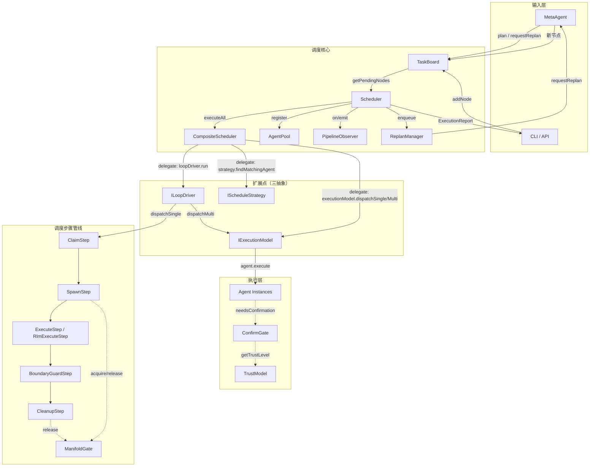
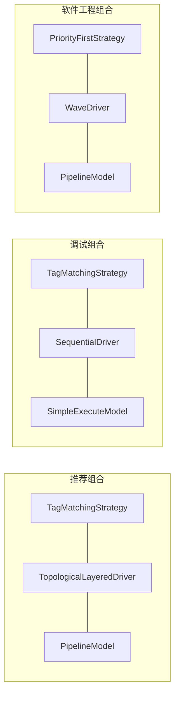
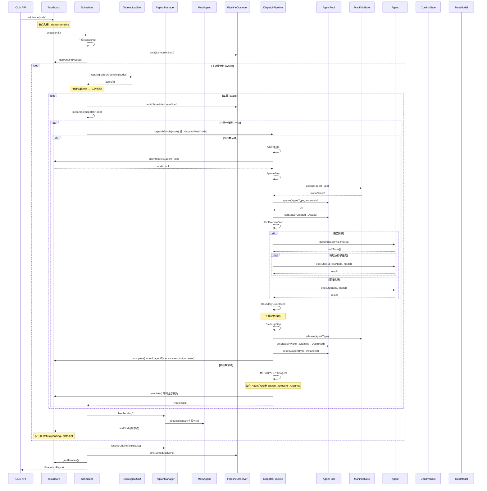

# 调度系统架构文档 (Scheduler Architecture)

> 本文档基于 `packages/engine/src/core/` 源代码及 `EXPLORATION_FINDINGS.md` 分析报告撰写。
> 涵盖调度系统的组件职责、交互协议、扩展点设计及完整调度链路。
> 版本: v2.9 (组合式重构) · 最后更新: 2026-07-14

---

## 目录

1. [系统整体架构概览](#1-系统整体架构概览)
2. [核心组件职责与交互](#2-核心组件职责与交互)
   - 2.1 TaskBoard — 任务板
   - 2.2 AgentPool — Agent 池
   - 2.3 Scheduler — 调度器主类
   - 2.4 CompositeScheduler — 组合式调度器
   - 2.5 ConfirmGate — 确认门
   - 2.6 PipelineObserver — 可观测事件管道
3. [三抽象扩展点设计](#3-三抽象扩展点设计)
   - 3.1 IScheduleStrategy — 调度策略
   - 3.2 ILoopDriver — 循环驱动
   - 3.3 IExecutionModel — 执行范式
   - 3.4 组合空间与可行方案
4. [PipelineModel vs SimpleExecuteModel](#4-pipelinemodel-vs-simpleexecutemodel)
5. [完整调度链路：从 addNode 到 executeAll](#5-完整调度链路从-addnode-到-executeall)
   - 5.1 节点入板与拓扑排序
   - 5.2 分层并行分发
   - 5.3 单视角分发管线 (Dispatch Pipeline)
   - 5.4 多视角分发管线
   - 5.5 重规划闭环
   - 5.6 落盘与 ExecutionReport
6. [Dispatch Pipeline 步骤详解](#6-dispatch-pipeline-步骤详解)
7. [异常处理与契约](#7-异常处理与契约)
8. [附录：组件依赖关系表](#8-附录组件依赖关系表)

---

## 1. 系统整体架构概览

调度系统位于 `packages/engine/src/core/`，是引擎的核心中枢。它接收 MetaAgent 规划的 TaskNode 树，通过**拓扑排序 → 分层并行 → Dispatch Pipeline** 的路径，将节点分发给匹配的 Agent 执行，最终产出 `ExecutionReport`。

### 组件关系图



---

## 2. 核心组件职责与交互

### 2.1 TaskBoard — 任务板

**文件**: `core/task-board.ts`
**接口**: `ITaskBoard`
**类**: `TaskBoard`

**职责**:
- 节点生命周期管理：`addNode` → `claim` → `complete` / `failNode`
- 维护节点状态机（`pending → claimed → done/failed`）
- 多视角节点（`needsMultiPerspective`）的并行认领与等齐判断
- 节点查询：`getPendingNodes`、`getNode`、`getAllNodes`
- 节点移除：`removeNode`、`removeSubtree`、`cancel`

**状态机**:

```
普通节点:
  pending ──claim()──→ claimed ──complete()──→ done/failed
                    └──release()──→ pending

多视角节点:
  pending ──claim(A)──→ running ──claim(B)──→ running ──complete(A)+complete(B)──→ done
                    │                           │
                    └──release(A)──→ pending     └──release(B)──→ pending(若全部释放)
```

**核心协议**（Scheduler ↔ TaskBoard）：

| 方法 | 调用方 | 语义 |
|------|--------|------|
| `claim(nodeId, agentType)` | DispatchStep | 认领节点，返回节点引用或 null |
| `release(nodeId, agentType)` | DispatchStep | 释放认领（失败回滚） |
| `complete(nodeId, agentType, success, output, error)` | CleanupStep | 写入结果，触发状态转移 |
| `failNode(nodeId)` | Scheduler | 强制标记失败（无匹配 Agent 等场景） |
| `findPending(agentType)` | 策略层 | 查找某 Agent 可认领的节点 |

**设计要点**:
- 同步原子操作：在 Node.js 单线程事件循环中天然并发安全
- 双通道 invariant 上报：`_observer` 实例优先于 `TaskBoard.onInvariant` 静态字段，`console.error` 为最后防线
- 多视角等齐逻辑：使用 `claimedBy` 集合判齐，而非预定义的 `_expectedAgentTypes`，灵活适应动态 Agent 匹配

### 2.2 AgentPool — Agent 池

**文件**: `core/agent-pool.ts`
**接口**: `ISchedulerAgentPool`（最小契约） / `IAgentPool`（完整管理）
**类**: `AgentPool`

**职责**:
- Agent 实例的 `spawn` / `destroy` 生命周期管理
- 状态机追踪：`Created → Awake → Active → Awake → ... → Draining → Destroyed`
- 配额控制：`maxInstances` 限制每 Agent 类型的并发上限
- 子任务不占主配额：`spawnSubtask()` 用于 RLM 子任务

**最小契约 (`ISchedulerAgentPool`)**:

```typescript
export interface ISchedulerAgentPool {
  spawn(agentType, instanceId): boolean;
  spawnSubtask(agentType, instanceId): boolean;
  getStatus(instanceId): AgentStatus | undefined;
  setStatus(instanceId, status): boolean;
  destroy(agentType, instanceId): void;
}
```

**设计要点**:
- 接口分离：`ISchedulerAgentPool` 仅暴露 5 个方法供 Scheduler 使用，`IAgentPool` 扩展完整管理端
- 状态流转校验：`VALID_TRANSITIONS` 静态表 + `setStatus()` 合法性检查
- 方案 B（状态所有权归一）：Agent 状态由 Pool 统一管理，`Agent.status` 改为委托到 Pool 的只读 getter
- mHC 流形约束：`ManifoldGate` 与 Pool 联动，达到 `maxInstances` 后 FIFO 排队

### 2.3 Scheduler — 调度器主类

**文件**: `core/scheduler.ts`
**接口**: `IScheduler`
**类**: `Scheduler`

**职责**:
- 注册 Agent 与模型映射（`register(agentType, agent, model)`）
- 执行全部节点（`executeAll()` → `ExecutionReport`）
- 拓扑排序 → 逐层并行分发
- 重规划闭环（通过 `ReplanManager` 与 `MetaAgent` 联动）
- 全局超时保护、循环依赖检测

**核心数据流**:

```
TaskBoard(输入)
  → topologicalSort() 分层
    → 逐层 Promise.allSettled(dispatchNode)
      → _dispatchSingle: Claim → Spawn → RlmExecute → BoundaryGuard → Cleanup
      → _dispatchMulti: 并行分发所有匹配 Agent
    → replanManager.tryFireReplan() 处理重规划
  → board.complete() 落盘 → observer.emit() 事件
  → ExecutionReport(输出)
```

**依赖契约**:
- `ITaskBoard`（注入）— 节点生命周期
- `ISchedulerAgentPool`（注入）— Agent 实例管理
- `IPipelineObserver`（注入）— 事件发布
- `MetaAgent`（可选注入）— 重规划
- `ReplanManager`（内部创建）— 重规划队列管理

### 2.4 CompositeScheduler — 组合式调度器

**文件**: `core/composite-scheduler.ts`
**接口**: `IScheduler`（与 Scheduler 相同）
**类**: `CompositeScheduler`

**职责**:
- 将调度行为拆解为三个可替换维度的组合
- 保持与 `Scheduler` 完全兼容的 `IScheduler` 接口
- 默认行为与旧 Scheduler 一致

**三抽象维度**:

```
IScheduleStrategy  — 节点→Agent 匹配策略
ILoopDriver        — 执行循环推进方式
IExecutionModel    — 单节点执行范式
```

**默认组合**: `TagMatchingStrategy` + `TopologicalLayeredDriver` + `PipelineModel`

**与 Scheduler 的关系**:

```
Scheduler:          硬编码固定管线，不可扩展
CompositeScheduler: 三维度接口可替换，行为可组合
                    可作为 Scheduler 的 drop-in 替换
```

### 2.5 ConfirmGate — 确认门

**文件**: `core/confirm-gate.ts`
**类**: `ConfirmGate`

**职责**:
- 基于**可逆性等级**（L0/L1/L2/L3）拦截或放行工具调用
- 通过 `PlatformBridge` 提供用户交互通道
- 通过 `TrustModel` 动态判定 L1 操作是否需确认

**可逆性等级**:

| 等级 | 语义 | 确认行为 |
|------|------|----------|
| L0 | 可逆（读取/查询） | 永不确认 |
| L1 | 低风险（写入可回滚） | 信任模型判定：TrustLevel ≥ L3 免确认 |
| L2 | 中风险（写入难回滚） | 永远确认 |
| L3 | 高风险（写入不可逆） | 永远确认 |

**核心协议**:

```
request(req) → waitFor(id) → resolve(response) / handleTimeout(id)
```

**集成方式**:
- `SpawnStep` / `ExecuteStep` 可通过 `ConfirmGate.needsConfirmation()` 决定是否等待用户确认
- `TrustModel` 注入后，L1 操作从静态放行变为动态信任判定

### 2.6 PipelineObserver — 可观测事件管道

**文件**: `core/pipeline-observer.ts`
**接口**: `IPipelineObserver`
**类**: `PipelineObserver`

**职责**:
- 优先级回调注册表：`PipelinePriority.CRITICAL / HIGH / NORMAL`
- 事件发射：`emit(event)` 按优先级分发
- 精确移除：`off(priority, handler?)` 支持按引用移除

**事件类型**（部分）:

| 事件 | 发射时机 | 优先级 |
|------|----------|--------|
| `NodeStart` | 节点开始分发 | HIGH |
| `NodeComplete` | 节点执行成功 | HIGH |
| `NodeFailed` | 节点执行失败 | CRITICAL |
| `NodeRemoved` | 节点被移除 | NORMAL |
| `SchedulerLayerStart` | 每层开始执行 | HIGH |
| `SchedulerDone` | 全部执行完成 | CRITICAL |
| `SchedulerLoopCrashed` | 调度循环异常中断 | CRITICAL |
| `AgentBoundaryViolation` | Agent 越界写文件 | HIGH |
| `ManifoldGateWaitStart/End` | 流控排队/唤醒 | HIGH |

**订阅约定**:
- Sentinel → CRITICAL + HIGH
- MemoryStore → ALL（CRITICAL + HIGH + NORMAL）
- 管家 → HIGH + NORMAL

---

## 3. 三抽象扩展点设计

### 3.1 IScheduleStrategy — 调度策略

**文件**: `core/scheduling-types.ts` + `core/scheduling-implementations.ts`

```typescript
export interface IScheduleStrategy {
  readonly name: string;
  findMatchingAgent(node: TaskNode, agents: Map<string, Agent>): string | null;
  findAllMatchingAgents(node: TaskNode, agents: Map<string, Agent>): string[];
}
```

**职责**: 决定任务节点由哪个/哪些 Agent 执行。

**内置实现**:

| 实现 | 名称 | 策略 | 适用场景 |
|------|------|------|----------|
| `TagMatchingStrategy` | `tag-matching` | 按 AGENT_TAGS 标签匹配 + 密度打破平局 | **默认**，通用场景 |
| `RoundRobinStrategy` | `round-robin` | 轮转分配，忽略标签 | 同构 Agent 池负载均衡 |
| `PriorityFirstStrategy` | `priority-first` | 增强标签匹配：空闲 Agent 优先 | 混合负载，避免热点 |

**扩展方式**: 实现 `IScheduleStrategy` 接口，并在 `CompositeSchedulerConfig` 中注入。

### 3.2 ILoopDriver — 循环驱动

**文件**: `core/scheduling-types.ts` + `core/scheduling-implementations.ts`

```typescript
export interface ILoopDriver {
  readonly name: string;
  run(ctx: LoopContext): Promise<LoopResult>;
}
```

**职责**: 控制执行循环如何推进——单节点如何被组织成轮次和层。

**内置实现**:

| 实现 | 名称 | 策略 | 适用场景 |
|------|------|------|----------|
| `TopologicalLayeredDriver` | `topological-layered` | 拓扑排序→逐层并行，含重规划队列 | **默认**，通用场景 |
| `SequentialDriver` | `sequential` | 严格顺序执行，无拓扑排序 | 调试/简单依赖场景 |
| `WaveDriver` | `wave` | 波浪式：design→implement→review→verify | 软件开发流程语义化 |

**`LoopContext` 注入内容**:

```typescript
interface LoopContext {
  board: ITaskBoard;
  pool: ISchedulerAgentPool;
  observer: IPipelineObserver;
  agents: Map<string, Agent>;
  models: Map<string, string>;
  metaAgent?: MetaAgent;
  replanManager: ReplanManager;
  config: Required<EngineConfig>;
  strategy: IScheduleStrategy;       // 当前策略
  executionModel: IExecutionModel;   // 当前范式
}
```

### 3.3 IExecutionModel — 执行范式

**文件**: `core/scheduling-types.ts` + `core/scheduling-implementations.ts`

```typescript
export interface IExecutionModel {
  readonly name: string;
  dispatchSingle(ctx: ExecutionContext): Promise<NodeResult>;
  dispatchMulti(ctx: ExecutionContext): Promise<NodeResult>;
}
```

**职责**: 控制单个任务节点的执行方式。

**内置实现**:

| 实现 | 名称 | 策略 | 适用场景 |
|------|------|------|----------|
| `PipelineModel` | `pipeline` | Claim→Spawn→Execute→BoundaryGuard→Cleanup | **默认**，完整调度管线 |
| `SimpleExecuteModel` | `simple` | 跳过管线，直接 agent.execute() | 测试/简单场景 |

### 3.4 组合空间与可行方案

三抽象的组合空间为 `策略 × 驱动 × 范式`，理论上约 75 种组合，实际可行的约 5-8 种：



**在 `CompositeSchedulerConfig` 中自定义组合**:

```typescript
const scheduler = new CompositeScheduler(board, pool, observer, metaAgent, engineConfig, {
  strategy: new RoundRobinStrategy(),
  loopDriver: new SequentialDriver(),
  executionModel: new SimpleExecuteModel(),
});
```

---

## 4. PipelineModel vs SimpleExecuteModel

### 对比表

| 维度 | PipelineModel | SimpleExecuteModel |
|------|--------------|-------------------|
| **管线步骤** | Claim → Spawn → (Rlm)Execute → BoundaryGuard → Cleanup | 无管线，直接 `agent.execute()` |
| **认领 (Claim)** | ClaimStep 执行标签匹配 + board.claim() | 无——SimpleExecuteModel 自行调用 strategy.findMatchingAgent() |
| **池管理 (Spawn)** | SpawnStep 执行 pool.spawn() + 状态唤醒 + mHC 流控 | 无——不管理实例生命周期 |
| **RLM 递归拆解** | RlmExecuteStep 支持动态拆解 + 分层并行子任务 | 不支持——直接 execute |
| **边界守卫** | BoundaryGuardStep 扫描文件越界 | 无 |
| **落盘 (Cleanup)** | CleanupStep 执行 board.complete() + pool.destroy() | 无——调用方需自行处理 |
| **mHC 流形约束** | SpawnStep + CleanupStep 通过 ManifoldGate 控制并发 | 无——无并发控制 |
| **多视角支持** | 完整并行分发 + 结果聚合 | 回退到单视角（`dispatchMulti()` 委托给 `dispatchSingle()`） |
| **性能开销** | 较高（每个节点经过 5 步管线） | 极低（一次方法调用） |
| **适用场景** | **生产环境**：需要完整生命周期管理、边界保护、RLM 拆解 | **测试环境**：单元测试、简单原型、调试 |

### 架构决策：何时使用哪个

```
场景                          推荐范式
─────────────────────────────────────────────────
生产环境，全功能调度            PipelineModel（默认）
单元测试，mock 调用             SimpleExecuteModel
调试特定节点，跳过基础设施       SimpleExecuteModel
性能压测，排除管线干扰           SimpleExecuteModel
多视角 Agent 并行              PipelineModel（唯一支持）
RLM 递归拆解需求               PipelineModel（RlmExecuteStep）
边界安全审计需求                PipelineModel（BoundaryGuardStep）
```

### 内部实现差异

**PipelineModel.dispatchSingle**:
```typescript
// 伪代码
async dispatchSingle(ctx):
  steps = [ClaimStep, SpawnStep, RlmExecuteStep, BoundaryGuardStep, CleanupStep]
  for step in steps:
    ctx = await step.run(ctx)
    if ctx.result?.failed && step !== Cleanup:
      await CleanupStep.run(ctx)  // 保证落盘
      break
  return ctx.result
```

**SimpleExecuteModel.dispatchSingle**:
```typescript
// 伪代码
async dispatchSingle(ctx):
  agentType = strategy.findMatchingAgent(node, agents)  // 无 Claim
  agent = agents.get(agentType)
  return await agent.execute(node, model)                // 直接执行
```

---

## 5. 完整调度链路：从 addNode 到 executeAll

### 全链路 Mermaid 流程图



### 5.1 节点入板与拓扑排序

**addNode 阶段**:

```
CLI/MetaAgent
  → TaskBoard.addNode(node)
    → node.status = "pending"
    → nodes Map 存储
```

**拓扑排序阶段** (`topologicalSort()`):

```
输入: pendingNodes (TaskNode[])
算法: BFS 分层
  - 无 parentId → 根节点 → 第 0 层
  - hard 边（默认）→ 子节点在下一层
  - soft/trigger 边 → 子节点与父节点同层（并行）
  - 悬挂 parentId → 子节点提升为根（警告）
  - 循环依赖 → 返回空数组，调用方标记失败
输出: layers[][] (二维数组，每层可并行执行)
```

### 5.2 分层并行分发

Scheduler 的主循环逐层执行：

```typescript
// 伪代码
while (hasPendingNodes) {
  const layers = topologicalSort(pendingNodes);
  for (const layer of layers) {
    const promises = layer.map(nodeId => dispatchNode(nodeId));
    const results = await Promise.allSettled(promises);
    // 汇总 results
  }
  // 处理重规划队列
  if (replanManager.hasPending) {
    await replanManager.tryFireReplan();  // MetaAgent 产出新节点入板
  }
}
```

### 5.3 单视角分发管线 (Dispatch Pipeline)

```
_dispatchSingle(node)
  │
  ├─ ClaimStep:     findMatchingAgent → board.claim()
  ├─ SpawnStep:     ManifoldGate.acquire → pool.spawn() → setStatus(Created→Awake)
  ├─ RlmExecuteStep: 尝试 LLM 拆解，回退直接执行
  ├─ BoundaryGuardStep: 扫描文件越界
  └─ CleanupStep:   ManifoldGate.release → pool.destroy() → board.complete()
```

### 5.4 多视角分发管线

```
_dispatchMulti(node)
  │
  └─ findAllMatchingAgents → 每个 Agent 类型：
       ├─ board.claim(node.id, agentType)
       ├─ SpawnStep → pool.spawn()
       ├─ RlmExecuteStep → agent.execute()
       ├─ BoundaryGuardStep
       └─ CleanupStep → board.complete()
  └─ 等齐全部视角 → 聚合结果
```

### 5.5 重规划闭环

```
节点失败
  → replanManager.enqueue(node, reason)
    → tryFireReplan()
      → MetaAgent.requestReplan(node, reason)
        → MetaAgent.plan() 产出新节点树
          → TaskBoard.addNode(newNodes)
            → 下一轮调度循环自动消费
              （"领而不执"：新节点入板但本轮不执行）
```

### 5.6 落盘与 ExecutionReport

```
全部节点终态（done/failed）
  → board.getAllNodes()
  → 统计 completed/failed/durationMs
  → PipelineObserver.emit(SchedulerDone)
  → 返回 ExecutionReport {
      totalNodes,
      completed,
      failed,
      results: NodeResult[],
      durationMs,
      sessionId,
    }
```

---

## 6. Dispatch Pipeline 步骤详解

### 6.1 ClaimStep

| 属性 | 值 |
|------|-----|
| 文件 | `core/dispatch-steps/claim-step.ts` |
| 名称 | `Claim` |
| 前置条件 | `ctx.node` 存在，`ctx.agents` 已注册 |
| 后置条件 | `ctx.agentType` 和 `ctx.agent` 已填充，或 `ctx.result` 为错误 |
| 失败场景 | 无匹配 Agent、Agent 未注册、board.claim() 返回 null |

**内部流程**:
1. `findMatchingAgent(agents, node)` 按标签匹配
2. 非标准 AgentType 诊断：emit `SchedulerNonstandardType` 事件 + console.warn
3. `board.claim(node.id, agentType)` 原子认领
4. 失败时 `board.failNode(node.id)` + 设置错误 `ctx.result`

### 6.2 SpawnStep

| 属性 | 值 |
|------|-----|
| 文件 | `core/dispatch-steps/spawn-step.ts` |
| 名称 | `Spawn` |
| 前置条件 | `ctx.agentType` 和 `ctx.agent` 已填充 |
| 后置条件 | `ctx.instanceId` 已填充，Agent 实例已唤醒 |
| 失败场景 | mHC 流控超时、池配额耗尽、Agent 状态非法 |

**内部流程**:
1. `ManifoldGate.acquire(agentType, timeout)` — 流形约束槽位获取
2. `pool.spawn(agentType, instanceId)` 或 `pool.spawnSubtask()`（RLM 子任务）
3. `agent.setPool(pool, instanceId)` — 方案 B：状态所有权归一
4. `pool.setStatus(Created → Awake)` — 唤醒
5. Agent 状态校验（仅 Awake/Active 可执行）
6. 失败时：释放 mHC 槽位 + `board.release()` + `board.failNode()` + 设置错误 `ctx.result`

### 6.3 RlmExecuteStep

| 属性 | 值 |
|------|-----|
| 文件 | `core/dispatch-steps/rlm-execute-step.ts` |
| 名称 | `RlmExecute` |
| 前置条件 | `ctx.agent` 和 `ctx.model` 可用 |
| 后置条件 | `ctx.result` 已填充（成功或失败） |
| 最大深度 | `MAX_RLM_DEPTH = 3` |
| 并行上限 | `MAX_PARALLEL_SUBTASKS = 5` |

**决策树**:

```
1. shouldAttemptDecompose(node)?
   ├─ isRlmSubtask=true → 不拆（防无限递归）
   ├─ preferredStrategy=direct/react → 不拆
   └─ shouldDecompose(payload, tags, strategy)?
       ├─ 是 → LLM decompose() → shouldExecuteDecomposition(result)?
       │    ├─ 是 → _executeSubTasks() 分层并行执行子任务
       │    └─ 否 → 回退 _directExecute()
       └─ 否 → _directExecute()
```

### 6.4 BoundaryGuardStep

| 属性 | 值 |
|------|-----|
| 文件 | `core/dispatch-steps/boundary-guard-step.ts` |
| 名称 | `BoundaryGuard` |
| 前置条件 | `ctx.result.success = true`（仅检查成功执行） |
| 后置条件 | 越界时 `ctx.boundaryViolation` 已标记 |

**内部流程**:
1. 查找 `BOUNDARY_RULES` 中与 `agentType` 匹配的规则
2. 扫描 workspace 中 `mtimeMs > node.createdAt` 的新文件
3. 检查是否命中规则中的 `forbidden` 文件模式（glob 匹配）
4. 越界 → emit `AgentBoundaryViolation` 事件 + 标记 `ctx.boundaryViolation`

### 6.5 CleanupStep

| 属性 | 值 |
|------|-----|
| 文件 | `core/dispatch-steps/cleanup-step.ts` |
| 名称 | `Cleanup` |
| 前置条件 | 无（始终执行，前置步骤失败则静默返回） |
| 后置条件 | mHC 槽位释放、Pool 实例销毁、Board 落盘 |

**内部流程**:
1. `ManifoldGate.release(agentType)` — 释放流形约束槽位
2. Pool 优雅降级：`setStatus(Awake/Active → Draining → Destroyed)` + `pool.destroy()`
3. `board.complete(nodeId, agentType, success, output, error)` — 落盘
4. 成功时 emit `NodeComplete` 事件

### 6.6 ManifoldGate — 流形约束门控

| 属性 | 值 |
|------|-----|
| 文件 | `core/dispatch-steps/manifold-gate.ts` |
| 类 | `ManifoldGate`（全局静态单例） |
| 语义 | 同类型 Agent 并发数 ≤ maxInstances |
| 队列 | FIFO 公平排队，无饥饿 |

**设计要点**:
- 静态单例：Scheduler 单例运行期间只存在一个调度循环
- `acquire()` 返回 `Promise<boolean>` — 超时返回 false，调用方优雅失败
- `release()` 唤醒下一个等待者（FIFO）
- `reset()` 清理所有定时器 + resolve(false)
- `drain()` 优雅关闭：拒绝新 acquire，等待活跃任务完成

---

## 7. 异常处理与契约

### 7.1 异常语义

| 异常场景 | 处理方式 | 事件 |
|----------|----------|------|
| 单轮调度异常 | 标记 pending 为 failed，emit SchedulerLoopCrashed，break 返回已有结果 | `SchedulerLoopCrashed` |
| dispatchNode 异常 | 不阻断 complete 落盘 | `NodeFailed` |
| pool.destroy() 异常 | 上报 PoolDestroyFailed，不阻断 Cleanup | `PoolDestroyFailed` |
| 全局超时 | 标记剩余 pending 为 failed，break | `SchedulerLoopCrashed` |
| 循环依赖 | 所有涉及节点标记 failed | `SchedulerInvariantViolation` |
| 无匹配 Agent | board.failNode() + 错误 result | 无（result 带错误） |
| mHC 流控超时 | board.release() + board.failNode() | `ManifoldGateAcquireTimeout` |

### 7.2 核心契约

**Scheduler ↔ TaskBoard**:

```
前置条件:
  - TaskBoard 至少有一个 pending 节点
  - 已注册至少一个 Agent 类型
后置条件:
  - 所有节点终态为 done 或 failed
  - 无 pending/claimed 残留
  - 所有 pool 实例已 destroy
```

**Dispatch Pipeline**:

```
前置条件:
  各 Step 的依赖已由前序 Step 填充（Claim→Spawn→Execute→Cleanup）
后置条件:
  - 无论成功/失败，CleanupStep 始终运行
  - board.complete() 一定被调用（防节点卡 claimed）
  - pool.destroy() 一定被调用（防资源泄漏）
不变量:
  - results 中每个 agentType 必须存在于 claimedBy 中
  - done/failed 终态不可逆
```

---

## 8. 附录：组件依赖关系表

| 组件 | 依赖 | 被依赖 |
|------|------|--------|
| `TaskBoard` | `@cortex/shared`（类型）, `PipelineObserver`（可选） | `Scheduler`, `CompositeScheduler`, `DispatchStep` |
| `AgentPool` | `@cortex/shared`, `ManifoldGate` | `Scheduler`, `CompositeScheduler`, `SpawnStep`, `CleanupStep` |
| `Scheduler` | `TaskBoard`, `AgentPool`, `PipelineObserver`, `MetaAgent`（可选） | `CLI`, `EngineBridge` |
| `CompositeScheduler` | `TaskBoard`, `AgentPool`, `PipelineObserver`, 三抽象实现 | `CLI`, `EngineBridge`（drop-in 替换 Scheduler） |
| `ConfirmGate` | `PlatformBridge`, `TrustModel`（可选） | `SpawnStep`, `ExecuteStep`（通过 `needsConfirmation()`） |
| `PipelineObserver` | `@cortex/shared` | 所有 emit 事件的组件 |
| `ReplanManager` | `TaskBoard`, `MetaAgent` | `Scheduler`, `CompositeScheduler` |
| `ManifoldGate` | `PipelineObserver`（可选） | `SpawnStep`, `CleanupStep`, `AgentPool` |
| `MetaAgent` | `TaskBoard`, `LlmAdapter` | `Scheduler`, `ReplanManager` |
| `TopologicalSort` | 无（纯函数） | `Scheduler`, `CompositeScheduler`（通过 `TopologicalLayeredDriver`） |

### 文件索引

| 组件 | 源文件 | 测试文件 |
|------|--------|----------|
| Scheduler | `core/scheduler.ts` | `tests/scheduler.test.ts` |
| CompositeScheduler | `core/composite-scheduler.ts` | （无独立测试，通过集成测试覆盖） |
| TaskBoard | `core/task-board.ts` | `tests/task-board.test.ts` |
| AgentPool | `core/agent-pool.ts` | `tests/agent-pool.test.ts` |
| ConfirmGate | `core/confirm-gate.ts` | `tests/confirm-gate.test.ts` |
| PipelineObserver | `core/pipeline-observer.ts` | `tests/pipeline-observer.test.ts` |
| 三抽象类型 | `core/scheduling-types.ts` | — |
| 三抽象实现 | `core/scheduling-implementations.ts` | （无独立测试） |
| 调度步骤 | `core/dispatch-steps/*.ts` | （各步骤缺少独立测试） |
| ManifoldGate | `core/dispatch-steps/manifold-gate.ts` | `tests/manifold-gate.test.ts` |
| ReplanManager | `core/replan-manager.ts` | — |
| MetaAgent | `core/meta-agent.ts` | — |
| TopologicalSort | `core/topological-sort.ts` | `tests/topological-sort-edge.test.ts` |

---

> **文档约定**: 本文档中的 Mermaid 图遵循以下规范以保证语法正确性：
> - 所有节点 ID 使用字母和数字（无中文、无空格、无特殊字符）
> - 子图使用 `subgraph "标题"` 语法
> - sequence diagram 使用 `participant` 声明参与者
> - 注释使用 `Note over` 或 `Note right of`
> - 条件分支使用 `alt / else / end`

---

```json
{
  "skillTemplate": {
    "name": "撰写架构文档时的可复用模式",
    "version": "1.0",
    "patterns": [
      {
        "category": "组件关系描述方法",
        "pattern": "三层次描述法",
        "description": "每个核心组件使用三段式结构描述：1) 职责（一句话 + 要点列表） 2) 核心接口/协议表格 3) 设计要点与架构决策。此结构既适合高层概览也适合深入细节，读者可选择性阅读。",
        "example": "参见本文档 §2 各组件节：先给出职责列表，再给出协议表格（方法/调用方/语义），最后列出设计要点。"
      },
      {
        "category": "Mermaid 图常见陷阱与规避",
        "pattern": "节点 ID 命名约束",
        "description": "Mermaid 节点 ID 中不能包含中文、空格、括号、连字符（-）等特殊字符。在绘制包含中文描述的节点时，必须使用纯字母 ID（如 TB、DS1），并通过节点文本语法 `ID[显示文本]` 来展示中文。",
        "example": "`TB[TaskBoard]` 而非 `TB[TaskBoard]`（正确）；`S[调度器]` 而非 `调度器[调度器]`（正确）"
      },
      {
        "category": "Mermaid 图常见陷阱与规避",
        "pattern": "子图边界标记",
        "description": "subgraph 的结束标记 `end` 必须与 subgraph 缩进对齐。在嵌套子图中，内层 subgraph 的 `end` 必须在外层 subgraph 的 `end` 之前。",
        "example": "参见本文档 §1 组件关系图：三层子图嵌套（输入层/调度核心/执行层），每层使用独立的 subgraph/end 块"
      },
      {
        "category": "Mermaid 图常见陷阱与规避",
        "pattern": "Sequence Diagram 参与者声明",
        "description": "在多参与者长时序图中，使用 `participant` 显式声明所有参与者并赋予简短别名，避免消息行过长。参与者顺序应按交互时间流排列。",
        "example": "参见本文档 §5 全链路时序图：`participant C as CLI / API` 等 11 个参与者按执行顺序声明"
      },
      {
        "category": "文档组织模式",
        "pattern": "渐进式信息披露",
        "description": "从高层概览开始（组件关系图），逐步深入到职责交互（组件章节）、扩展点设计（接口章节）、再到完整流程（时序图 + 分步解释）。每节只依赖前面已介绍的内容。",
        "example": "本文档从 §1 概览图 → §2 组件职责 → §3 扩展点 → §4 模型对比 → §5 完整流程 → §6 步骤详解，层层递进"
      },
      {
        "category": "接口描述模式",
        "pattern": "三抽象扩展点文档模板",
        "description": "对于框架中的可替换接口（策略模式），使用统一的模板：1) 接口签名 2) 职责一句话 3) 内置实现表格（实现名/策略/适用场景） 4) 扩展方式。让读者能快速理解扩展点从而自行实现。",
        "example": "参见本文档 §3：IScheduleStrategy / ILoopDriver / IExecutionModel 均使用此模板"
      },
      {
        "category": "代码阅读顺序",
        "pattern": "自顶向下 + 关注边界",
        "description": "阅读源码撰写文档时，先读接口/类型定义文件（scheduling-types.ts）建立概念模型，再读主类（scheduler.ts, composite-scheduler.ts）理解流程，最后读实现（scheduling-implementations.ts）和步骤（dispatch-steps/）了解细节。特别注意接口与实现的分割点（解耦边界）。",
        "example": "本文档的撰写路径：scheduling-types.ts → scheduler.ts → composite-scheduler.ts → scheduling-implementations.ts → dispatch-steps/*.ts"
      }
    ]
  }
}
```
