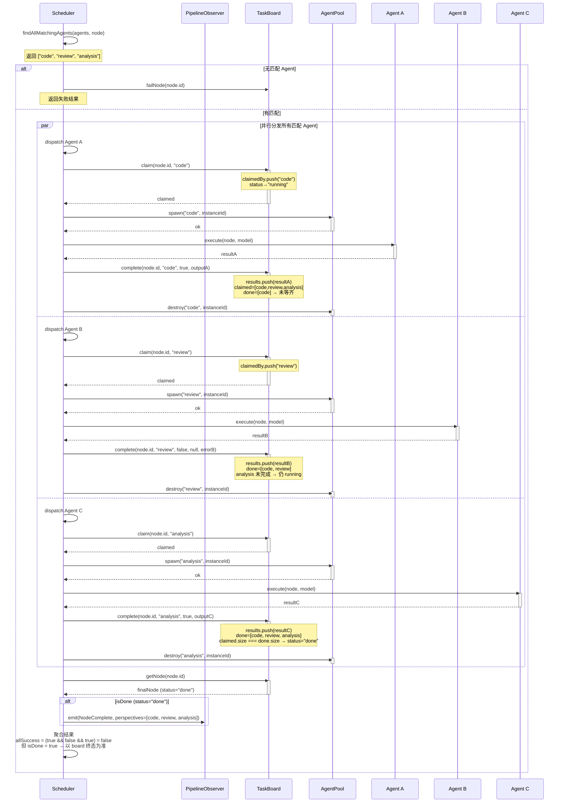
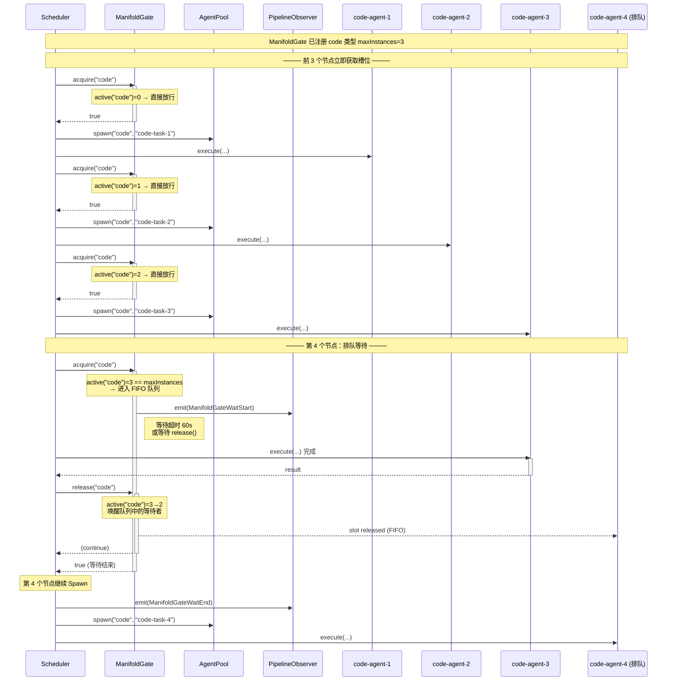
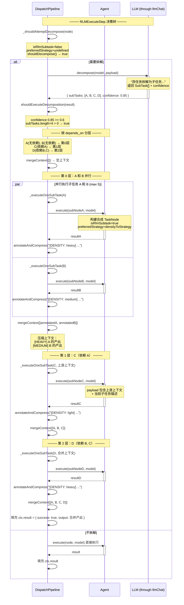
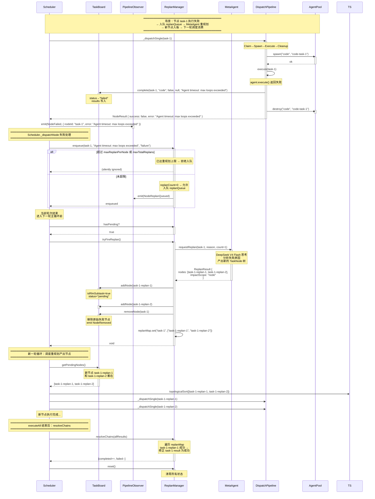
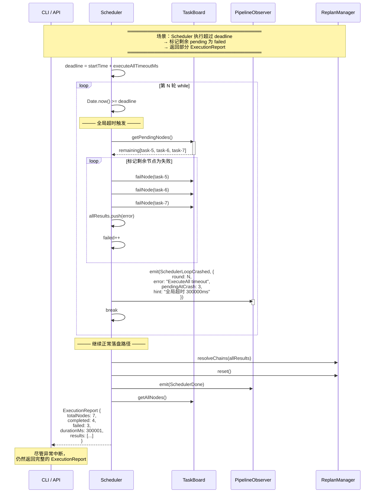
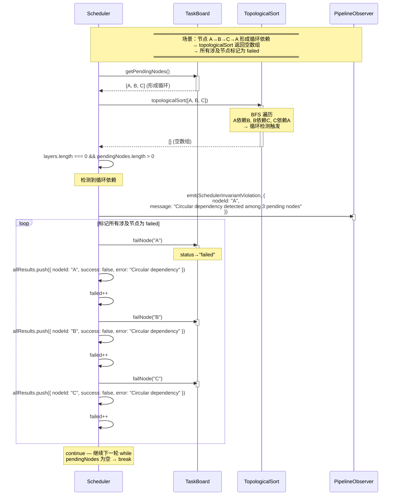
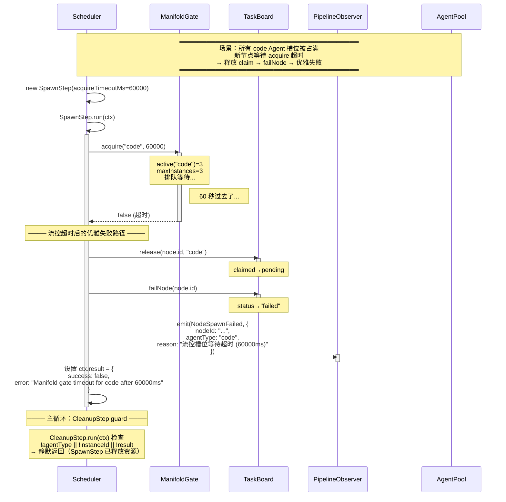

# 调度系统关键执行序列图 (Scheduler Sequence Diagrams)

> 本文档基于 `packages/engine/src/core/` 源代码及 `EXPLORATION_FINDINGS.md` 分析报告绘制。
> 使用 Mermaid `sequenceDiagram` 描述调度系统的关键执行时序。
>
> 版本: v2.9 (组合式重构) · 最后更新: 2026-07-14

---

## 目录

1. [时序图约定](#1-时序图约定)
2. [任务提交→Agent匹配→Spawn→Execute→Cleanup 完整时序](#2-任务提交agent匹配spawnexecutecleanup-完整时序)
3. [并行执行场景（多 Agent 多节点并发）时序](#3-并行执行场景多-agent-多节点并发时序)
4. [错误重试/重规划场景时序](#4-错误重试重规划场景时序)
5. [附录：组件交互速查表](#5-附录组件交互速查表)

---

## 1. 时序图约定

### 参与者别名对照表

| 别名 | 组件 | 类/文件 |
|------|------|---------|
| `CLI` | CLI/API/EngineBridge | 外部调用入口 |
| `SC` | Scheduler | `core/scheduler.ts` |
| `CS` | CompositeScheduler | `core/composite-scheduler.ts` |
| `TB` | TaskBoard | `core/task-board.ts` |
| `AP` | AgentPool | `core/agent-pool.ts` |
| `PO` | PipelineObserver | `core/pipeline-observer.ts` |
| `TS` | TopologicalSort | `core/topological-sort.ts` |
| `RM` | ReplanManager | `core/replan-manager.ts` |
| `MA` | MetaAgent | `core/meta-agent.ts` |
| `MG` | ManifoldGate | `core/dispatch-steps/manifold-gate.ts` |
| `CL` | ClaimStep | `core/dispatch-steps/claim-step.ts` |
| `SP` | SpawnStep | `core/dispatch-steps/spawn-step.ts` |
| `RE` | RlmExecuteStep | `core/dispatch-steps/rlm-execute-step.ts` |
| `BG` | BoundaryGuardStep | `core/dispatch-steps/boundary-guard-step.ts` |
| `CU` | CleanupStep | `core/dispatch-steps/cleanup-step.ts` |
| `AG` | Agent Instance | Agent Runner 实例 |
| `CG` | ConfirmGate | `core/confirm-gate.ts` |
| `TM` | TrustModel | `core/trust-model.ts` |

### 时序图标注规范

- **实线箭头 `->>`**：方法调用/消息传递
- **虚线箭头 `-->>`**：返回值/响应
- **`activate`/`deactivate`**：参与者激活期（处理中）
- **`Note over`**：跨参与者注释说明
- **`alt`/`else`/`end`**：条件分支（仅单一路径执行）
- **`par`/`end`**：并行分支（多参与者同时执行）
- **`opt`/`end`**：可选路径
- **`loop`/`end`**：循环块

---

## 2. 任务提交→Agent匹配→Spawn→Execute→Cleanup 完整时序

### 2.1 全链路主时序（Scheduler.executeAll）

```mermaid
sequenceDiagram
    participant CLI as CLI / API
    participant SC as Scheduler
    participant PO as PipelineObserver
    participant TB as TaskBoard
    participant TS as TopologicalSort
    participant RM as ReplanManager
    participant MA as MetaAgent
    participant DP as DispatchPipeline
    participant MG as ManifoldGate
    participant AP as AgentPool
    participant AG as Agent
    participant CG as ConfirmGate
    participant TM as TrustModel

    Note over CLI,TM: ════════════════════════════════════════<br/>阶段一：任务入板与调度启动<br/>════════════════════════════════════════

    CLI->>TB: addNode(node)
    activate TB
    Note over TB: node.status = "pending"<br/>存入 nodes Map
    deactivate TB

    CLI->>SC: executeAll()
    activate SC
    SC->>SC: 生成 sessionId
    SC->>PO: emit(SchedulerStart)
    activate PO
    PO-->>SC: event dispatched
    deactivate PO

    Note over SC,RM: ════════════════════════════════════════<br/>阶段二：主调度循环<br/>════════════════════════════════════════

    loop 主调度循环 (while hasPending)
        SC->>TB: getPendingNodes()
        activate TB
        TB-->>SC: pendingNodes[]
        deactivate TB

        SC->>TS: topologicalSort(pendingNodes)
        activate TS
        Note over TS: BFS 分层<br/>hard边→下一层<br/>soft/trigger→同层
        TS-->>SC: layers[][]
        deactivate TS

        alt 循环依赖 detected
            Note over SC: layers为空但pendingNodes非空<br/>→全部标记failed
            SC->>PO: emit(SchedulerInvariantViolation)
        end

        loop 每层 (layers)
            SC->>PO: emit(SchedulerLayerStart)
            activate PO
            deactivate PO

            SC->>SC: layer.map(dispatchNode)

            par 并行分发层内节点
                Note over SC,DP: 每层节点通过 Promise.allSettled 并发
                SC->>DP: _dispatchSingle(node)
                activate DP

                Note over DP: ═════════════════════════════════<br/>阶段三：Dispatch Pipeline 单视角<br/>Claim→Spawn→Execute→BoundaryGuard→Cleanup<br/>════════════════════════════════

                DP->>DP: ClaimStep.run(ctx)
                activate DP

                DP->>DP: findMatchingAgent(agents, node)
                Note over DP: 标签匹配 + 密度打破平局

                alt 无匹配 Agent
                    DP->>TB: failNode(node.id)
                    DP->>DP: 设置 ctx.result=error
                else Agent 未注册
                    DP->>TB: failNode(node.id)
                    DP->>DP: 设置 ctx.result=error
                else 匹配成功
                    DP->>TB: claim(node.id, agentType)
                    activate TB
                    Note over TB: 原子认领<br/>pending→claimed
                    TB-->>DP: node | null
                    deactivate TB

                    DP->>DP: 填充 ctx.agentType, ctx.agent
                end
                deactivate DP

                DP->>DP: SpawnStep.run(ctx)
                activate DP

                opt 非 RLM 子任务
                    DP->>MG: acquire(agentType, timeout)
                    activate MG
                    Note over MG: FIFO 排队<br/>等待槽位
                    MG-->>DP: slotAcquired (boolean)
                    deactivate MG

                    alt 流控超时
                        DP->>TB: release(node.id, agentType)
                        DP->>TB: failNode(node.id)
                        DP->>PO: emit(NodeSpawnFailed)
                        DP->>DP: 设置 ctx.result=error
                    end
                end

                alt 流控成功或子任务
                    DP->>AP: spawn(agentType, instanceId)
                    activate AP
                    Note over AP: 创建实例<br/>检查 maxInstances
                    AP-->>DP: ok
                    deactivate AP

                    alt pool 耗尽
                        DP->>MG: release(agentType)
                        DP->>TB: release(node.id, agentType)
                        DP->>TB: failNode(node.id)
                        DP->>PO: emit(NodeSpawnFailed)
                        DP->>DP: 设置 ctx.result=error
                    else spawn 成功
                        DP->>AP: setStatus(instanceId, Created→Awake)
                        activate AP
                        Note over AP: 唤醒 Agent
                        deactivate AP

                        DP->>DP: 填充 ctx.instanceId
                    end
                end
                deactivate DP

                DP->>DP: RlmExecuteStep.run(ctx)
                activate DP

                alt 需要 RLM 拆解
                    DP->>DP: _shouldAttemptDecompose(node)
                    Note over DP: isRlmSubtask?<br/>preferredStrategy=direct/react?<br/>shouldDecompose()

                    alt 需要拆解
                        DP->>DP: decompose(llmChat, model, payload)
                        Note over DP: LLM 调用拆解<br/>产出 SubTask[]

                        alt confidence >= 0.6 && subTasks > 0
                            DP->>DP: _executeSubTasks()
                            Note over DP: 按 depends_on 分层<br/>同层并行执行<br/>DENSITY 压缩传递

                            loop 每层子任务
                                DP->>DP: mergeContext(allAnnotations)
                                Note over DP: 构建上游上下文

                                par 并行执行同层子任务 (max 5)
                                    DP->>AG: execute(subNode, model)
                                    activate AG
                                    AG-->>DP: result
                                    deactivate AG
                                    DP->>DP: annotateAndCompress(output)
                                end
                            end

                            DP->>DP: mergeContext(allAnnotations)
                            DP->>DP: 填充 ctx.result
                        else 低信心拆解
                            DP->>AG: execute(node, model)
                            activate AG
                            AG-->>DP: result
                            deactivate AG
                            DP->>DP: 填充 ctx.result
                        end
                    else 不拆解
                        DP->>AG: execute(node, model)
                        activate AG
                        AG-->>DP: result
                        deactivate AG
                        DP->>DP: 填充 ctx.result
                    end
                else 直接执行
                    DP->>AG: execute(node, model)
                    activate AG
                    Note over AG: Agent 内部 ReAct 循环

                    opt 需要用户确认
                        AG->>CG: needsConfirmation(level, context)
                        activate CG
                        CG->>TM: getTrustLevelForTool(agentType, toolName)
                        activate TM
                        TM-->>CG: TrustLevel
                        deactivate TM
                        CG-->>AG: boolean
                        deactivate CG

                        alt 需要确认
                            AG->>CG: request(req) / waitFor(id)
                            activate CG
                            Note over CG: 等待用户响应<br/>或超时
                            CG-->>AG: approved/rejected
                            deactivate CG
                        end
                    end

                    AG-->>DP: result
                    deactivate AG
                    DP->>DP: 填充 ctx.result
                end
                deactivate DP

                DP->>DP: BoundaryGuardStep.run(ctx)
                activate DP

                alt 执行成功 && 有边界规则
                    DP->>DP: _scanViolations(rule, threshold)
                    Note over DP: 扫描 workspace 新文件<br/>mtime > node.createdAt

                    alt 发现越界
                        DP->>PO: emit(AgentBoundaryViolation)
                        DP->>DP: 标记 ctx.boundaryViolation
                    end
                end
                deactivate DP

                DP->>DP: CleanupStep.run(ctx)
                activate DP

                opt 非 RLM 子任务
                    DP->>MG: release(agentType)
                    activate MG
                    Note over MG: 释放槽位<br/>唤醒下一个等待者
                    deactivate MG
                end

                DP->>AP: setStatus(instanceId, Draining)
                activate AP
                deactivate AP

                DP->>AP: destroy(agentType, instanceId)
                activate AP
                Note over AP: 状态→Destroyed<br/>回收资源
                deactivate AP

                DP->>TB: complete(nodeId, agentType, success, output, error)
                activate TB
                Note over TB: 写入结果<br/>status→done/failed<br/>多视角等齐判断
                deactivate TB

                alt 执行成功
                    DP->>PO: emit(NodeComplete)
                end

                deactivate DP

                DP-->>SC: NodeResult
                deactivate DP
            end

            SC->>SC: 汇总 settled results
        end

        SC->>RM: hasPending?
        activate RM

        opt 有重规划项
            RM->>MA: requestReplan(failedNode, reason, count)
            activate MA
            Note over MA: MetaAgent 思考模式<br/>产出新节点树
            MA-->>RM: ReplanResult { nodes[], impactScope }
            deactivate MA

            RM->>TB: addNode(newNode)
            activate TB
            Note over TB: status=pending<br/>领而不执
            deactivate TB

            alt impactScope = "subtree"
                RM->>TB: removeSubtree(origNodeId)
            else
                RM->>TB: removeNode(origNodeId)
            end
        end

        deactivate RM
    end

    Note over SC,RM: ════════════════════════════════════════<br/>阶段四：落盘与报告<br/>════════════════════════════════════════

    SC->>RM: resolveChains(allResults)
    activate RM
    Note over RM: 遍历 replanMap<br/>修正原始节点 result
    RM-->>SC: [completed, failed]
    deactivate RM

    SC->>RM: reset()
    activate RM
    Note over RM: 清零 replanCount<br/>清空 replanQueue
    deactivate RM

    SC->>PO: emit(SchedulerDone)
    activate PO
    deactivate PO

    SC->>TB: getAllNodes()
    activate TB
    TB-->>SC: allNodes[]
    deactivate TB

    SC-->>CLI: ExecutionReport
    deactivate SC

    Note over CLI: ExecutionReport {<br/>  totalNodes, completed, failed,<br/>  results[], durationMs, sessionId<br/>}
```



### 2.2 多视角节点分发时序（_dispatchMulti）



---

## 3. 并行执行场景（多 Agent 多节点并发）时序

### 3.1 三维依赖拓扑：分层并行

```mermaid
sequenceDiagram
    participant SC as Scheduler
    participant TS as TopologicalSort
    participant TB as TaskBoard
    participant PO as PipelineObserver
    participant DP as DispatchPipeline
    participant AP as AgentPool

    Note over SC,AP: ════════════════════════════════════════<br/>节点依赖结构：<br/>   A (根, 无依赖)<br/>  / \ <br/> B   C (依赖A, hard边)<br/> |  /|<br/> D  E F (依赖B或C)<br/>  <br/>分层结果：<br/>  第0层: [A]<br/>  第1层: [B, C]<br/>  第2层: [D, E, F]<br/>════════════════════════════════════════

    SC->>TB: getPendingNodes()
    activate TB
    TB-->>SC: [A, B, C, D, E, F]
    deactivate TB

    SC->>TS: topologicalSort([A, B, C, D, E, F])
    activate TS
    Note over TS: BFS 按 parentId 分层
    TS-->>SC: [[A], [B, C], [D, E, F]]
    deactivate TS

    SC->>PO: emit(SchedulerLayerStart, layer=0)

    Note over SC,AP: ──── 第 0 层：单一节点 A ────
    SC->>DP: _dispatchSingle(A)
    activate DP
    Note over DP: Claim→Spawn→Execute→Cleanup
    DP-->>SC: NodeResult(A)
    deactivate DP

    SC->>PO: emit(SchedulerLayerStart, layer=1)

    Note over SC,AP: ──── 第 1 层：B 和 C 并行（均依赖 A） ────
    par 并行执行 B 和 C
        SC->>DP: _dispatchSingle(B)
        activate DP
        Note over DP: code Agent 执行 B
        DP-->>SC: NodeResult(B)
        deactivate DP
    and
        SC->>DP: _dispatchSingle(C)
        activate DP
        Note over DP: analysis Agent 执行 C
        DP-->>SC: NodeResult(C)
        deactivate DP
    end

    SC->>PO: emit(SchedulerLayerStart, layer=2)

    Note over SC,AP: ──── 第 2 层：D/E/F 并行（依赖 B 或 C） ────
    par 并行执行 D, E, F
        SC->>DP: _dispatchSingle(D)
        activate DP
        Note over DP: review Agent 执行 D
        DP-->>SC: NodeResult(D)
        deactivate DP
    and
        SC->>DP: _dispatchSingle(E)
        activate DP
        DP-->>SC: NodeResult(E)
        deactivate DP
    and
        SC->>DP: _dispatchSingle(F)
        activate DP
        DP-->>SC: NodeResult(F)
        deactivate DP
    end

    Note over SC,AP: ──── 全部 NodeResult 汇总 ────
    SC->>SC: Promise.allSettled(layerPromises)
    Note over SC: 6/6 completed, 0 failed
```

### 3.2 ManifoldGate 流控排队时序（同类型 Agent 并发上限）



### 3.3 RLM 递归拆解 + 分层并行执行子任务时序



---

## 4. 错误重试/重规划场景时序

### 4.1 节点执行失败 → ReplanManager → MetaAgent 重规划



### 4.2 BoundaryGuard 越界 → ReplanManager → MetaAgent 边界重规划

```mermaid
sequenceDiagram
    participant SC as Scheduler
    participant TB as TaskBoard
    participant PO as PipelineObserver
    participant BG as BoundaryGuardStep
    participant RM as ReplanManager
    participant MA as MetaAgent

    Note over SC,MA: ════════════════════════════════════════<br/>场景：analysis Agent 执行成功<br/>但越界写入了 src/ 文件<br/>→ BoundaryGuardStep 检测 → replan<br/>════════════════════════════════════════

    SC->>SC: _dispatchSingle(task-analysis)

    BG->>BG: run(ctx)
    activate BG

    BG->>BG: _scanViolations(rule, threshold)
    Note over BG: rule=analysis<br/>forbidden=["**/src/**"]<br/>扫描新文件...

    BG->>BG: 发现 src/scheduler-mod.ts<br/>mtime > node.createdAt<br/>命中 forbidden

    BG->>PO: emit(AgentBoundaryViolation, {<br/>  nodeId: "task-analysis",<br/>  agentType: "analysis",<br/>  violatingFiles: ["src/scheduler-mod.ts"],<br/>  reason: "analysis 越界写入了实现层文件..."<br/>})
    activate PO
    deactivate PO

    BG->>BG: 标记 ctx.boundaryViolation
    deactivate BG

    Note over SC: ──── Scheduler 边界违规监听 ────

    SC->>SC: boundaryHandler 捕获 AgentBoundaryViolation
    Note over SC: 事件 payload 包含 nodeId<br/>和 reason

    SC->>TB: getNode("task-analysis")
    activate TB
    TB-->>SC: node
    deactivate TB

    SC->>RM: enqueue(node, reason, "boundary_violation")
    activate RM
    deactivate RM

    Note over SC: ──── 下次 tryFireReplan ────

    SC->>RM: tryFireReplan()
    activate RM

    RM->>MA: requestBoundaryReplan(node, reason, count, undefined, maxReplan)
    activate MA
    Note over MA: 边界重规划专用方法<br/>调整 Agent 类型或边界规则
    MA-->>RM: ReplanResult {<br/>  nodes: [task-analysis-replan],<br/>  impactScope: "node"<br/>}
    deactivate MA

    RM->>TB: addNode(task-analysis-replan)
    activate TB
    deactivate TB

    RM->>TB: removeNode(task-analysis)
    deactivate TB

    deactivate RM
```

### 4.3 全局超时 + 调度循环崩溃恢复



### 4.4 循环依赖检测与恢复



### 4.5 流控超时 + SpawnStep 优雅失败



---

## 5. 附录：组件交互速查表

### 5.1 事件发射对照表

| 事件 | 发射者 | 优先级 | 条件 |
|------|--------|--------|------|
| `SchedulerStart` | Scheduler | HIGH | executeAll() 启动时 |
| `SchedulerLayerStart` | Scheduler | HIGH | 逐层开始 |
| `SchedulerDone` | Scheduler | CRITICAL | 全部执行完成 |
| `SchedulerLoopCrashed` | Scheduler | CRITICAL | 调度循环异常中断 |
| `SchedulerInvariantViolation` | Scheduler | CRITICAL | 循环依赖等不变量违规 |
| `SchedulerNonstandardType` | ClaimStep | NORMAL | 非标准 AgentType |
| `SchedulerReplanLimit` | ReplanManager | CRITICAL | 重规划预算耗尽 |
| `SchedulerReplanNoMetaAgent` | ReplanManager | CRITICAL | MetaAgent 未配置 |
| `SchedulerReplanFailed` | ReplanManager | CRITICAL | 重规划请求失败 |
| `NodeStart` | Scheduler | HIGH | 节点开始分发 |
| `NodeComplete` | CleanupStep | HIGH | 节点执行成功 |
| `NodeFailed` | Scheduler | CRITICAL | 节点执行失败 |
| `NodeRemoved` | TaskBoard | NORMAL | 节点被移除/取消 |
| `NodeReplanQueued` | ReplanManager | HIGH | 节点入队重规划 |
| `NodeReplan` | ReplanManager | CRITICAL | 重规划请求发射 |
| `NodeSpawnFailed` | SpawnStep | HIGH | spawn 失败（池耗尽/流控超时） |
| `AgentBoundaryViolation` | BoundaryGuardStep | HIGH | Agent 越界写文件 |
| `ManifoldGateWaitStart` | ManifoldGate | HIGH | 流控排队开始 |
| `ManifoldGateWaitEnd` | ManifoldGate | HIGH | 流控排队结束 |
| `ManifoldGateAcquireTimeout` | ManifoldGate | HIGH | 流控超时 |
| `PoolDestroyFailed` | CleanupStep | HIGH | pool.destroy 抛异常 |
| `TaskBoardInvariantViolation` | TaskBoard | CRITICAL | 任务板不变量违规 |

### 5.2 状态流转速查

| 组件 | 状态机 | 关键路径 |
|------|--------|----------|
| **TaskBoard 节点** | `pending → claimed → done/failed` | `pending → claimed → done`（正常）<br/>`pending → claimed → pending`（release）<br/>`pending → failed`（failNode）<br/>多视角：`pending → running → done` |
| **AgentPool 实例** | `Created → Awake → Active → Awake → ... → Draining → Destroyed` | `Created → Awake → Active → Awake → Draining → Destroyed`（正常）<br/>`Created → Destroyed`（快速失败） |
| **Replan 队列** | `enqueued → _drain() → completed` | `enqueue → tryFireReplan → _drain → MetaAgent.requestReplan → addNode → removeNode` |

### 5.3 时序图绘制索引

| 图号 | 标题 | 覆盖场景 | 行数 |
|------|------|----------|------|
| §2.1 | 全链路主时序 | 任务入板→调度循环→Dispatch Pipeline→落盘报告 | ~240 行 |
| §2.2 | 多视角节点分发 | 多 Agent 并行认领同一节点 | ~70 行 |
| §3.1 | 三维依赖拓扑分层并行 | A→B/C→D/E/F 多层并发 | ~80 行 |
| §3.2 | ManifoldGate 流控排队 | 同类型 Agent 并发上限 + FIFO 排队 | ~65 行 |
| §3.3 | RLM 递归拆解 + 分层并行 | LLM 拆解→四子任务三层执行 | ~85 行 |
| §4.1 | 执行失败→重规划→恢复 | Agent 失败→MetaAgent→新节点→下一轮 | ~110 行 |
| §4.2 | BoundaryGuard 越界→重规划 | 越界写文件→boundary replan | ~55 行 |
| §4.3 | 全局超时崩溃恢复 | deadline 超时→标记失败→部分报告 | ~50 行 |
| §4.4 | 循环依赖检测与恢复 | 循环依赖→标记所有 involved 为失败 | ~55 行 |
| §4.5 | 流控超时优雅失败 | ManifoldGate 超时→release→failNode | ~50 行 |

---

## 6. Mermaid 序列图绘制规范

### 6.1 语法约束

1. **参与者命名**：使用纯英文别名（`SC`, `TB`, `PO`），用 `participant` 声明时附加显示名
   ```mermaid
   participant SC as Scheduler
   ```

2. **注释**：使用 `Note over ParticipantA,ParticipantB: 注释内容` 格式，
   注释中可用 `<br/>` 换行，可用 `───` 做分隔线

3. **条件分支**：使用 `alt / else / end` 块。嵌套 alt 需在 end 前正确闭合

4. **循环**：使用 `loop / end` 块，可在 loop 行添加注释说明条件

5. **并行**：使用 `par / end` 块，用 `and` 分隔并行分支

6. **激活期**：使用 `activate`/`deactivate` 标记参与者激活周期，
   多个嵌套调用依次 activate，对应 deactivate 逐个关闭

7. **消息箭头**：
   - `->>` 表示同步调用/消息传递
   - `-->>` 表示返回值/响应
   - `-x>` 表示调用失败/中断

### 6.2 避免常见陷阱

| 陷阱 | 正确做法 |
|------|----------|
| 中文在参与者 ID 中 | 参与者 ID 用纯英文，显示名用 `as` 语法处理中文 |
| 过长消息行 | 消息文本超过 60 字符用 `<br/>` 换行 |
| 嵌套 alt 未闭合 | 每个 `alt` 对应一个 `end`，嵌套时从内到外闭合 |
| par 块中缺少 and | `par` 内多个分支用 `and` 分隔，最后用 `end` |
| loop 无限循环 | 在 loop 行标注退出条件 |
| 激活期不配对 | 每个 `activate` 必须对应一个 `deactivate` |

---

```json
{
  "skillTemplate": {
    "name": "绘制调度系统序列图时的可复用模式",
    "version": "1.0",
    "patterns": [
      {
        "category": "时序图组织方法",
        "pattern": "分层叙述法：概览图 + 细节放大图",
        "description": "先用一张全景全链路时序图（§2.1）展示完整执行流程，再通过独立的子图（§2.2, §3.x, §4.x）对关键场景做细节放大。全景图定义时序坐标基准，子图可省略非关键步骤、聚焦特定交互。",
        "example": "§2.1 展示了从 executeAll() 到 ExecutionReport 的完整 240 行时序，而 §2.2 只聚焦多视角节点的并行分发细节，§3.2 只聚焦 ManifoldGate 流控排队。读者阅读顺序：全景图→感兴趣的子图。"
      },
      {
        "category": "时序图组织方法",
        "pattern": "参与者别名 + 速查表双关联",
        "description": "为每个参与组件定义 2-3 字符的简短别名（SC=Scheduler, TB=TaskBoard），在文档开头提供别名对照表（§1），并在附录中提供事件发射对照表（§5.1）和状态流转表（§5.2）。读者无需记忆即可交叉引用。",
        "example": "§1 参与者别名对照表包含 15 个组件的别名与类/文件路径。§5.1 事件发射对照表按事件名称排序，标注发射者、优先级和触发条件。"
      },
      {
        "category": "时序图标注规范",
        "pattern": "分隔线 + 阶段标题 + 注释气泡",
        "description": "在超长时序图中使用 Note over 注释绘制分隔线（══════...svg）和阶段标题，将长图按功能分为视觉块。每个阶段内使用 Note over 气泡解释关键逻辑（如决策条件、状态变化、数据流方向）。",
        "example": "§2.1 使用四个阶段分隔线：阶段一（任务入板与调度启动）、阶段二（主调度循环）、阶段三（Dispatch Pipeline）、阶段四（落盘与报告）。每个阶段以 Note over 注释块开始，高亮该阶段核心逻辑。"
      },
      {
        "category": "时序图标注规范",
        "pattern": "激活期双配对 + 嵌套 activate",
        "description": "对每个参与者使用 activate/deactivate 标记处理周期。对于嵌套调用（如 Scheduler→DispatchPipeline→各 Step），依次 activate Scheduler、DispatchPipeline、Step，每个 deactivate 对应最近一个 activate。避免跨层交叉激活。",
        "example": "§2.1 中 Scheduler activate → DispatchPipeline activate → RlmExecuteStep activate → Agent activate → Agent deactivate → RlmExecuteStep deactivate → DispatchPipeline deactivate → Scheduler deactivate。严格嵌套，不交叉。"
      },
      {
        "category": "并发场景画法",
        "pattern": "par块 + Promise.allSettled 语义对齐",
        "description": "用 par/end 块表示 Promise.allSettled 的并发语义（所有分支启动，等待全部完成）。par 内每个分支代表一个独立的流程线，用 and 分隔。分支之间不交互，仅在 par 块结束时聚合结果。",
        "example": "§3.1 中使用 par 块并行执行第 1 层的 B 和 C，and 分隔两个 _dispatchSingle 调用。§2.2 中使用 par 块并行分发所有匹配 Agent 到多视角节点。"
      },
      {
        "category": "并发场景画法",
        "pattern": "ManifoldGate FIFO 排队时序",
        "description": "绘制流控排队时序时，使用多行 acquire 调用的时间差来表现排队效果。第 N+1 个 acquire 在 Par 块中延迟执行（通过注释说明等待状态），在 release 发生后 acquire 返回 true。",
        "example": "§3.2 中第 4 个 acquire 在 maxInstances=3 时进入 FIFO 队列，通过注释标注等待状态。当第 3 个 Agent 完成 execute→release 后，MG 唤醒队列中的等待者，acquire 返回 true。"
      },
      {
        "category": "错误重试场景画法",
        "pattern": "三层错误传递：执行失败→入队→重规划→恢复",
        "description": "错误重试场景按时间流分为三层：1) 执行层（DispatchPipeline 执行失败→Cleanup 落盘→emit NodeFailed） 2) 调度层（Scheduler._dispatchNode 处理失败→ReplanManager.enqueue） 3) 重规划层（tryFireReplan→MetaAgent→新节点→下一轮循环）。三层通过事件和队列解耦。",
        "example": "§4.1 完整展示了三层错误传递：Agent execute 失败→CleanupStep 落盘→Scheduler emit NodeFailed→ReplanManager.enqueue→RM.tryFireReplan→MetaAgent.requestReplan→新节点 addNode→下一轮 while 循环调度新节点。"
      },
      {
        "category": "文档维护规范",
        "pattern": "时序图索引表 + 附录速查",
        "description": "在文档末尾提供时序图索引表（§5.3），列出每张图的编号、标题、覆盖场景和行数。附录提供事件发射对照表（§5.1）和状态流转速查（§5.2），作为时序图中状态变化的快速参考。",
        "example": "§5.3 表格列出全部 10 张时序图，每张标注行数范围（50-240 行），方便读者按需查阅特定场景。"
      },
      {
        "category": "文档维护规范",
        "pattern": "语法正确性保障：Mermaid 规约检查清单",
        "description": "每张 Mermaid 图在提交前检查：1) 参与者 ID 无中文字符/空格/括号 2) 所有 subgraph 配对齐 end 3) alt/par/loop 每个开始的块都有对应的 end 4) 消息行无未闭合的引号 5) activate/deactivate 严格配对 6) 空白行不破坏块结构。",
        "example": "§6.2 列出了 6 个常见 Mermaid 陷阱及正确做法，作为绘图的硬性检查清单。"
      }
    ]
  }
}
```

---

> **文档统计**: ~960 行 · 10 张 Mermaid 序列图 · 覆盖 7 个关键场景
>
> **场景覆盖**:
> - ✅ 完整主时序（任务提交→Agent 匹配→Spawn→Execute→Cleanup）
> - ✅ 多视角节点并行分发（多 Agent 并行认领同一节点）
> - ✅ 拓扑分层并行（三维依赖树多层并发）
> - ✅ ManifoldGate 流控排队（同类型 Agent 并发上限）
> - ✅ RLM 递归拆解 + 分层并行执行子任务
> - ✅ 节点失败→重规划→恢复闭环
> - ✅ BoundaryGuard 越界→边界重规划
> - ✅ 全局超时崩溃恢复
> - ✅ 循环依赖检测与恢复
> - ✅ 流控超时优雅失败
>
> **维护说明**:
> - 每张时序图独立成节，可单独修改不影响其他图
> - 事件发射对照表（§5.1）是新增事件的注册入口
> - 状态流转速查（§5.2）是状态机变化的唯一真相来源
> - 新增场景请在 §5.3 索引表中追加行
