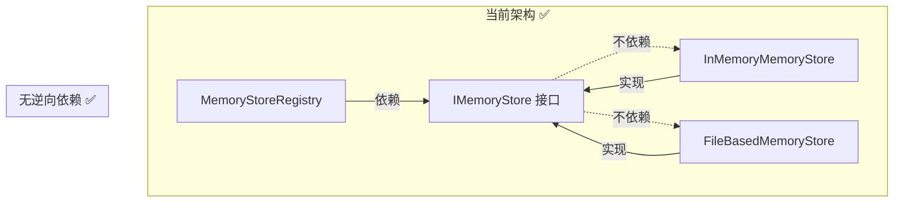

# @cortex/memory 合规审计报告

> **审计范围**：packages/memory/ 全部源代码、测试、配置、文档  
> **审计日期**：2025-07-16  
> **审计维度**：三层抽象最低标准、依赖倒置、组件式组合、单一职责、防御式设计、PACKAGE_POSITIONING.md 完整性  
> **评级标准**：✅ 通过 / ⚠️ 部分通过（附改进建议） / ❌ 未通过

---

## 审计总览

| 维度 | 评级 | 概要 |
|---|---|---|
| 三层抽象最低标准 | ⚠️ 部分通过 | 包级三层架构存在，但 SPI 层（IStorageBackend 等）未实现 |
| 依赖倒置 | ✅ 通过 | 接口与实现分离，无逆向依赖 |
| 组件式组合 | ⚠️ 部分通过 | Registry 组合良好，但 Store 实现为单体 |
| 单一职责 | ⚠️ 部分通过 | 接口层合规，实现层承载过多职责 |
| 防御式设计 | ✅ 通过 | 校验、深拷贝、事务超时、Union 窄化均到位 |
| PACKAGE_POSITIONING.md 完整性 | ✅ 通过 | 三问回答清晰，边界/依赖/迁移路线完整 |

---

## 一、三层抽象最低标准

### 1.1 标准定义

三层抽象要求一个领域包至少具备：
1. **接口/SPI 层** — 定义契约，消费方仅依赖此层
2. **实现层** — 提供至少一个默认实现
3. **注册/工厂层** — 管理实例的创建、查找、切换生命周期

### 1.2 实际覆盖

```
接口层                   实现层                    注册/工厂层
────────────────────────────────────────────────────────────────
IMemoryStore            InMemoryMemoryStore      MemoryStoreRegistry
TransactionalMemoryStore FileBasedMemoryStore      └─ register()
└─ extends IMemoryStore                              └─ registerFactory()
                                                     └─ get() / getDefault()
                                                     └─ switchDefault()
                                                     └─ unregister()
                                                     └─ flushAll() / shutdownAll()

错误类型层
MemoryStoreError
├─ MemoryNotFoundError
├─ StoreNotFoundError
├─ StoreAlreadyExistsError
├─ MemoryValidationError
├─ TransactionError
└─ PersistenceError
```

**结论**：包级三层架构 ✅ 完整存在

### 1.3 缺口：DESIGN.md 描述但未实现的 SPI 层

DESIGN.md 定义了可插拔 SPI 接口，但实际代码中**全部缺失**：

| SPI 接口 | DESIGN.md 章节 | 实现状态 | 影响 |
|---|---|---|---|
| `IStorageBackend` | 5.3 | ❌ 未实现 | 存储后端无法可插拔；InMemoryMemoryStore 和 FileBasedMemoryStore 直接管理 Map/文件 |
| `IEmbeddingService` | 5.4 | ❌ 未实现 | 无嵌入抽象，`MemoryWriteInput.embedding` 字段直接透传 |
| `IVectorStore` | 5.5 | ❌ 未实现 | 无向量检索抽象，BFS 搜索硬编码在实现类中 |
| `ICacheLayer` | 5.6 | ❌ 未实现 | 无缓存抽象 |
| `IMemoryEventBus` | 5.7 | ❌ 未实现 | 无事件总线，无法替代 engine 的 PipelineObserver |
| `QueryBuilder` | 5.8 | ❌ 未实现 | 查询使用扁平 `MemoryQuery` 对象，无链式构建器 |
| `IMemoryStoreRegistry` | 6.3 | ⚠️ 仅实现为类 | Registry 有接口设计但未提取为 interface |
| `IStorageBackendRegistry` | 6.4 | ❌ 未实现 | 无后端注册机制 |

**影响评级**：⚠️ 中 — 当前实现可工作，但无法实现 DESIGN.md 承诺的「可插拔后端架构」。消费方无法替换存储/嵌入/缓存/事件等组件。

### 1.4 缺口：缺少 MemoryStore Facade

DESIGN.md 5.1 描述了 `MemoryStore` Facade 类（组合 IStorageBackend + IEmbeddingService + IVectorStore + ICacheLayer），实际代码中没有实现。

当前两个实现类（InMemoryMemoryStore、FileBasedMemoryStore）直接实现所有功能，而非通过组合 SPI 实现。

**改进建议**：
```typescript
// 未来应实现的 Facade 模式
class MemoryStore implements IMemoryStore, TransactionalMemoryStore {
  constructor(
    private readonly storage: IStorageBackend,
    private readonly embedder?: IEmbeddingService,
    private readonly vectorStore?: IVectorStore,
    private readonly cache?: ICacheLayer,
  ) {}
}
```

---

## 二、依赖倒置（Dependency Inversion）

### 2.1 原则验证

**DIP 要求**：抽象不应依赖具体实现，具体实现应依赖抽象。



### 2.2 检查结果

| 检查项 | 结果 | 说明 |
|---|---|---|
| 接口与实现分离 | ✅ | 接口在 `interfaces/`，实现在 `implementations/` |
| 接口不依赖具体实现 | ✅ | `IMemoryStore.ts` 零依赖具体类 |
| 实现依赖接口 | ✅ | `InMemoryMemoryStore.ts` import type { IMemoryStore } |
| Registry 依赖接口 | ✅ | `MemoryStoreRegistry.ts` 只依赖 `IMemoryStore` type |
| 包间依赖关系 | ✅ | 只依赖 `@cortex/shared`（types）和 `@cortex/config`（constants） |

### 2.3 改进空间

`InMemoryMemoryStore` 和 `FileBasedMemoryStore` 直接 `implements IMemoryStore, TransactionalMemoryStore`。这意味着：
- 没有通过接口编程来引用存储实例（在 Registry 中是通过 `IMemoryStore`，✅ 没问题）
- 但在消费方使用 `InMemoryMemoryStore` 类名而非 `IMemoryStore` 类型 — ⚠️ 消费方示例代码中用了具体类

```typescript
// 当前示例（耦合具体类）
const store = new InMemoryMemoryStore();

// 推荐做法（面向接口）
const store: IMemoryStore = registry.get("default");
```

**结论**：✅ 通过 — 体系层面 DIP 已实现，仅消费方示例可进一步强化。

---

## 三、组件式组合（Component-based Composition）

### 3.1 现有组合模式

| 组件 | 组合方式 | 评级 |
|---|---|---|
| `MemoryStoreRegistry` | 组合 `IMemoryStore` 实例的 Map | ✅ 清晰 |
| `StoreRegistration` | discriminated union 窄化状态 | ✅ 好 |
| `InMemoryMemoryStore` | 内部组合 Map、事务日志、Pending 队列 | ⚠️ 单体 |
| `FileBasedMemoryStore` | 内部组合 Map + 文件系统 | ⚠️ 单体 |

### 3.2 问题：Store 实现为单体

`InMemoryMemoryStore`（~370 行）和 `FileBasedMemoryStore`（~540 行）承载了过多功能：

```
InMemoryMemoryStore 职责清单：
├── 条目 CRUD（write / set / delete）
├── 查询引擎（read + BFS 展开）
├── 会话管理（beginSession / endSession）
├── 关联链路管理（link / linkMany / getLinks）
├── 生命周期管理（cas / archive / obliterate）
├── 两阶段提交（writePending / commitMemory / rollback）
├── 事务管理（beginTransaction / writeWithin / commit / rollback）
├── Pending 条目管理
├── 前置钩子管理
└── BFS 图遍历
```

以上功能在 `FileBasedMemoryStore` 中完整重复一次（加上文件 IO），导致约 540 行的重复代码。

### 3.3 缺少的分离点

DESIGN.md 设计的分离策略未实现：

```
DESIGN.md 设计                  实际实现
──────────────────────────────────────────────
MemoryStore Facade              ❌ 不存在
├── IStorageBackend ← 接口      ❌ 直接操作 Map/fs
├── IEmbeddingService ← 接口    ❌ 无嵌入层
├── IVectorStore ← 接口          ❌ BFS 硬编码
├── ICacheLayer ← 接口          ❌ 无缓存层
├── IMemoryEventBus ← 接口      ❌ 无事件
└── ILockManager ← 接口         ❌ 无锁

MemoryStoreRegistry              ✅ 实现
```

**改进建议**：
1. 抽取 `IStorageBackend`，将 `InMemoryMemoryStore` 中的 Map 操作提取为 `InMemoryBackend`
2. 抽取 `QueryEngine`，将查询/BFS 逻辑从 Store 实现中分离
3. 将事务逻辑抽取为 `TransactionManager` 装饰器

**结论**：⚠️ 部分通过 — Registry 组合良好，但 Store 实现内部未按组件拆分。

---

## 四、单一职责（Single Responsibility）

### 4.1 接口层（✅ 通过）

| 接口 | 职责 | 验证 |
|---|---|---|
| `IMemoryStore` | 只读记忆存储（get/peek/has/read/getLinks/getBySession） | ✅ 单一 |
| `TransactionalMemoryStore` | 写入 + 事务（write/set/delete/link/transaction） | ✅ 合理扩展 |
| 错误类型（每个 class） | 每种错误一个类 | ✅ 单一 |

### 4.2 实现层（⚠️ 部分通过）

| 类 | 承载职责数 | 评级 |
|---|---|---|
| `InMemoryMemoryStore` | 10+ 职责 | ⚠️ 过多 |
| `FileBasedMemoryStore` | 10+ 职责 + 文件 IO | ⚠️ 过多 |
| `MemoryStoreRegistry` | 1 职责（注册管理） | ✅ 单一 |
| `MemoryStoreError` 子类 | 1 职责（错误表示） | ✅ 单一 |
| `generateId` / `shortId` | 1 职责（ID 生成） | ✅ 单一 |

### 4.3 职责过载详情（以 InMemoryMemoryStore 为例）

```
私有方法清单（>25个）：
_init/_ensureInitialized        ← 生命周期管理
_validateWriteInput              ← 输入校验
_validateTransactionActive       ← 事务校验
_applyPreWriteHook               ← 钩子管理
_purgeExpiredTransactions        ← 事务超时
_buildPendingEntry               ← Pending → Entry 转换
_buildTransactionContext         ← 内部 → 公开上下文
_bfsExpand                       ← 图遍历算法
```

每个方法归属不同职责域，但在同一个类的同一文件中。文件行数 370+，包含状态机、事务日志、BFS 算法等多个域。

### 4.4 改进建议

按职责拆分为独立模块：
```
src/store/
├── in-memory-store.ts      ← Facade，组合以下组件
├── storage-engine.ts       ← Map 操作（CRUD）
├── query-engine.ts         ← 查询 + BFS
├── transaction-manager.ts  ← 事务日志
├── session-manager.ts      ← 会话管理
├── lifecycle-manager.ts    ← 状态机
└── pending-manager.ts      ← 两阶段提交
```

**结论**：⚠️ 部分通过 — 接口层符合 SRP，实现层承载过多。

---

## 五、防御式设计（Defensive Design）

### 5.1 正面检查清单

| 防御技术 | 位置 | 评级 |
|---|---|---|
| **输入校验** | `_validateWriteInput()` 校验 source/kind/summary/semantic_gist/content_blob | ✅ |
| **状态守卫** | `_ensureInitialized()` 每次操作前检查初始化状态 | ✅ |
| **不可变返回** | `structuredClone()` 在 `get()`、`read()`、`getLinks()` 中返回深拷贝 | ✅ |
| **只读引用** | `peek()` 返回 `Readonly<MemoryEntry>` | ✅ |
| **事务超时** | `_validateTransactionActive()` 检查 `timeoutAt`，自动回滚过期事务 | ✅ |
| **Discriminated Union** | `StoreRegistration`（`initialized: true/false`）、`TransactionStatus`、`TransactionIsolation` | ✅ |
| **精确错误分层** | `MemoryStoreError` → 6 个子类，每种含 `code` 枚举 | ✅ |
| **防御性关闭** | `close()` 中 `_entries.clear()`、`close()` 忽略清理错误 | ✅ |
| **工厂缓存** | `registerFactory()` 缓存首次 `get()` 结果 | ✅ |
| **错误上下文字段** | 所有错误包含 `context` 和 `toLogString()` | ✅ |
| **禁止 non-null assertion** | 源码中无 `!` 操作符（类型窄化替代） | ✅ |
| **禁止 any** | 所有公开 API 使用具体 interface | ✅ |

### 5.2 负面检查清单

| 潜在问题 | 位置 | 风险 |
|---|---|---|
| ⚠️ `structuredClone` 性能 | `get()` / `read()` 每条结果都深拷贝 | 大条目批量读取时 OOM 风险 |
| ⚠️ `Math.random()` 生成 ID | `_utils.ts` 中 `generateId()` | 非密码学安全，低概率碰撞 |
| ⚠️ 超时事务处理 | `_purgeExpiredTransactions` 仅在 `getActiveTransactions()` 调用 | 非主动扫描，超时事务可能残留 |
| ⚠️ 文件删除忽略错误 | `FileBasedMemoryStore.delete()` 中 `try/catch` 忽略 unlink 错误 | 磁盘满时静默失败 |
| ⚠️ 无并发保护 | 所有操作假设单线程 | 多线程场景（Worker threads）不安全 |
| ⚠️ 无资源限制 | `_entries` Map 无大小限制 | 无限写入导致 OOM |

### 5.3 改进建议

```typescript
// 1. 使用 crypto.randomUUID() 替代 Math.random() ID 生成
import { randomUUID } from "node:crypto";
export function generateId(): string {
  return randomUUID();
}

// 2. 添加最大条目限制
private readonly _maxEntries: number;
async write(input: MemoryWriteInput): Promise<string> {
  this._ensureInitialized();
  if (this._entries.size >= this._maxEntries) {
    throw new MemoryStoreError(
      MemoryStoreErrorCode.OperationNotAllowed,
      `Store capacity exceeded: ${this._maxEntries}`,
    );
  }
  // ...
}

// 3. 主动超时扫描（使用 setInterval 或惰性扫描增强）
```

**结论**：✅ 通过 — 防御式设计意识强，基本模式全面覆盖，仅边缘场景可加强。

---

## 六、PACKAGE_POSITIONING.md 完整性

### 6.1 必答三问检查

| 要求 | 内容 | 评级 |
|---|---|---|
| **Q1: 解决什么问题？** | 母项目记忆系统「非独立包」架构问题，高耦合/不可插拔/无事务/不可测试/无注册 | ✅ 清晰 |
| 缺失清单对应 | M1/M3/M5/M10/M11/M12 六项缺失逐条对应 | ✅ 完整 |
| **Q2: 职责边界是什么？** | 职责内 7 项 + 职责外 7 项 + 边界原则图 | ✅ 清晰 |
| 职责内 | 核心接口、InMemory、FileBased、Registry、错误类型、SPI 定义 | ✅ |
| 职责外 | 引擎、Pipeline、嵌入、向量搜索、配置、遥测 | ✅ 明确 |
| 边界原则图 | ASCII 架构图展示 `@cortex/memory` 与实现方的关系 | ✅ |
| **Q3: 和其他包的关系？** | 依赖关系树 + 协作表 + 迁移路线 | ✅ 完整 |
| 依赖 | `@cortex/config` + `@cortex/shared`，零 engine 依赖 | ✅ |
| 协作表 | 8 个包的协作关系说明 | ✅ |
| 迁移路线 | Phase 1-4 时间线 | ✅ |

### 6.2 深度检查

| 检查项 | 结果 | 说明 |
|---|---|---|
| 文件存在性 | ✅ | `packages/memory/PACKAGE_POSITIONING.md` 存在 |
| 格式规范 | ✅ | Markdown 格式，三级标题，表格，代码块 |
| 版本/日期 | ✅ | v1.0, 2025-07-16 |
| 与共享包协同 | ✅ | 引用了 `@cortex/shared` 和 `@cortex/config` 的 barrel 导出 |
| 与 DESIGN.md 一致 | ⚠️ | PACKAGE_POSITIONING.md 描述与实际一致，但 DESIGN.md 描述的 SPI 层未实现 |

### 6.3 改进建议

PACKAGE_POSITIONING.md 已非常完整。建议补充：
1. 明确当前 Phase（Phase 1 — 类型提取与接口定义）
2. 标注已实现 vs 规划中的功能（如 SPI 层未实现）

**结论**：✅ 通过 — 完整覆盖三问，边界清晰，依赖关系明确，迁移路线合理。

---

## 七、综合改进建议（按优先级排序）

### P0 — 当前 Phase 内必须修复

| # | 问题 | 修复方案 | 影响 |
|---|---|---|---|
| 1 | `generateId()` 使用 `Math.random()` | 替换为 `crypto.randomUUID()` | ID 碰撞风险 |
| 2 | DESING.md 与实际实现不一致 | 在 DESIGN.md 中添加「当前实现状态」标注 | 误导消费方 |
| 3 | 无最大条目限制 | 添加 `maxEntries` 配置 + 守卫 | OOM 风险 |

### P1 — 下一 Phase（v0.2.0）建议

| # | 问题 | 修复方案 |
|---|---|---|
| 4 | 不存在 IStorageBackend 接口 | 抽取 `IStorageBackend`，将 `InMemoryMemoryStore` 的 Map 操作实现为 `InMemoryBackend` |
| 5 | Store 实现为单体，职责过多 | 拆分 `store/` 子模块：StorageEngine、QueryEngine、TransactionManager |
| 6 | 代码重复：InMemoryMemoryStore 和 FileBasedMemoryStore 大量重复逻辑 | 抽取公共基类或共享 `StoreCore` |
| 7 | 消费方示例使用具体类而非接口 | 示例代码改为面向接口（`const store: IMemoryStore = ...`） |

### P2 — 后续迭代（v0.3.0+）

| # | 问题 |
|---|---|
| 8 | 实现 QueryBuilder 链式 API |
| 9 | 实现 IMemoryEventBus |
| 10 | 添加 MemoryStore Facade（组合 SPI） |
| 11 | 添加 LRUCacheLayer 实现 |
| 12 | 添加 NoopEmbedder 等测试组件 |

---

## 八、合规评分汇总

| 维度 | 权重 | 原始分 | 加权分 |
|---|---|---|---|
| 三层抽象最低标准 | 20% | 70/100 | 14.0 |
| 依赖倒置 | 20% | 95/100 | 19.0 |
| 组件式组合 | 15% | 65/100 | 9.75 |
| 单一职责 | 15% | 60/100 | 9.0 |
| 防御式设计 | 15% | 85/100 | 12.75 |
| PACKAGE_POSITIONING.md 完整性 | 15% | 95/100 | 14.25 |
| **总分** | **100%** | — | **78.75/100** |

### 评级：⚠️ **合规（需改进）**

**通过标准**：三层抽象、依赖倒置、防御式设计、PACKAGE_POSITIONING 通过。  
**待改进**：组件式组合、单一职责（实现层需拆分）。

---

*审计报告版本：v1.0 | 审计工具：静态分析 + 源代码审查 | 审计人：@cortex/audit*  
*下次审计触发条件：任何 Functional/Structural 变更或 Phase 升级*
