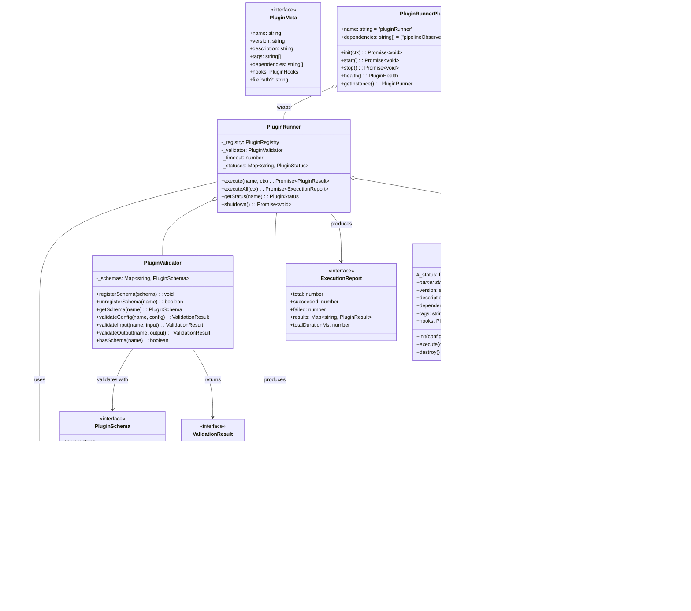

# @cortex/plugin-runner — 设计文档

> **版本**: v0.1.0 (设计草案)  
> **状态**: 设计阶段  
> **基于探索报告**: `.plan/exploration.md`  
> **生成日期**: 2026-06-01

---

## 目录

1. [包定位与职责](#1-包定位与职责)
2. [接口设计](#2-接口设计)
3. [模块划分](#3-模块划分)
4. [类图](#4-类图)
5. [依赖拓扑](#5-依赖拓扑)
6. [与引擎插件体系的关系](#6-与引擎插件体系的关系)
7. [目录结构](#7-目录结构)
8. [错误处理与防御策略](#8-错误处理与防御策略)
9. [配置设计](#9-配置设计)
10. [测试策略](#10-测试策略)

---

## 1. 包定位与职责

### 1.1 定位

`@cortex/plugin-runner` 是一个 **二级插件运行器**，嵌入在 `@cortex/engine` 的插件体系中。

```
┌──────────────────────────────────────────────────────────┐
│  @cortex/engine                                          │
│                                                          │
│  PluginLoader (一级插件: scheduler/memoryStore/...)       │
│      │                                                    │
│      ├── scheduler.plugin                                 │
│      ├── memoryStore.plugin                               │
│      ├── ...                                              │
│      └── plugin-runner.plugin  ← @cortex/plugin-runner   │
│              │                                            │
│              ▼  二级插件系统                                │
│         ┌───────────────────────────┐                     │
│         │  PluginRegistry           │                     │
│         │  PluginRunner             │  ← 本包核心         │
│         │  PluginValidator          │                     │
│         └───────────────────────────┘                     │
└──────────────────────────────────────────────────────────┘
```

### 1.2 职责

| 职责 | 说明 |
|------|------|
| **二级插件生命周期管理** | 管理外部/用户定义插件的 `init → execute → destroy` 生命周期 |
| **沙箱执行** | 隔离执行插件：单插件崩溃不波及宿主进程，超时切断、资源自动清理 |
| **插件注册表** | Registry 模式：按名称/标签/glob 路径发现和注册插件 |
| **Schema 校验** | 每个插件类型有独立的校验 schema，执行前校验配置和参数合法性 |
| **事件桥接** | 将二级插件的执行事件桥接到引擎的 `PipelineObserver` 事件总线 |

### 1.3 非职责（明确不做什么）

| 非职责 | 理由 |
|--------|------|
| 不替换 `PluginLoader` | `PluginLoader` 管理一级（引擎级）插件；本包管理二级（外部用户）插件 |
| 不管理 Agent/Scheduler/TaskBoard | 这些是引擎核心组件，不在此处重复封装 |
| 不提供进程级隔离 | 当前提供逻辑沙箱（超时/错误隔离/资源清理），进程级隔离（worker_threads）留待 v2 |
| 不隐式加载引擎内建插件 | 二级插件必须显式注册，不通过 `register-all.ts` 副作用导入 |

---

## 2. 接口设计

### 2.1 `Plugin` — 二级插件核心契约

```typescript
/**
 * Plugin —— 二级插件的生命周期接口。
 *
 * 生命周期顺序：constructor → init() → [execute()*] → destroy()
 *
 * - init(config):   注入配置、初始化内部状态（数据库连接、文件句柄等）
 * - execute(ctx):   执行插件核心逻辑，返回执行结果
 * - destroy():      优雅清理资源（关闭连接、释放锁、清除临时文件）
 *
 * @template TConfig  — 插件配置类型（执行 init 前由 PluginValidator 校验）
 * @template TResult  — 插件执行结果类型
 */
export interface Plugin<TConfig = PluginConfig, TResult = unknown> {
  /** 插件唯一名称（用于 Registry 查找和依赖声明） */
  readonly name: string;

  /** 插件语义版本号（遵循 semver） */
  readonly version: string;

  /** 短描述（≤ 80 字符，用于 registry list 展示） */
  readonly description: string;

  /** 依赖的二级插件名称列表（registry 按此解析执行顺序） */
  readonly dependencies: string[];

  /** 插件标签（用于 findByTag 分类检索） */
  readonly tags: string[];

  /** 支持的钩子声明（PluginRunner 据此决定是否调用对应钩子） */
  readonly hooks: PluginHooks;

  /** 初始化——注入配置，准备运行时状态 */
  init(config: TConfig): Promise<void>;

  /** 执行核心逻辑 */
  execute(context: ExecuteContext): Promise<PluginResult<TResult>>;

  /** 清理——释放资源 */
  destroy(): Promise<void>;
}
```

### 2.2 `PluginMeta` — 插件元数据（轻量，不导出实例）

```typescript
/**
 * PluginMeta —— 插件注册时的元信息。
 * 用于 registry list / discover 返回，无需加载完整插件实例。
 */
export interface PluginMeta {
  /** 插件名称 */
  name: string;
  /** 版本 */
  version: string;
  /** 描述 */
  description: string;
  /** 标签 */
  tags: string[];
  /** 依赖列表 */
  dependencies: string[];
  /** 钩子声明 */
  hooks: PluginHooks;
  /** 插件文件路径（从文件发现时有值） */
  filePath?: string;
}
```

### 2.3 `PluginHooks` — 生命周期钩子声明

```typescript
/**
 * PluginHooks —— 插件支持的生命周期钩子。
 * PluginRunner 根据此声明选择性地调用对应生命周期方法。
 *
 * 所有字段可选——插件只实现自己需要的钩子。
 */
export interface PluginHooks {
  /** 执行前钩子 */
  beforeExecute?: boolean;
  /** 执行后钩子 */
  afterExecute?: boolean;
  /** 错误处理钩子 */
  onError?: boolean;
  /** 资源清理钩子 */
  onCleanup?: boolean;
}
```

### 2.4 `ExecuteContext` — 执行上下文

```typescript
/**
 * ExecuteContext —— execute() 时注入的运行时上下文。
 * 类似于 PluginContext（引擎一级插件），但面向二级插件。
 */
export interface ExecuteContext {
  /** 任务载荷（由调用方传入） */
  payload: unknown;

  /** 已初始化的依赖插件映射（按 name → Plugin） */
  deps: Map<string, Plugin>;

  /** 运行时的临时工作目录（PluginRunner 分配，destroy 时清理） */
  workDir: string;

  /** 超时时间 ms（覆盖默认值） */
  timeoutMs?: number;

  /** 中止信号（外部可触发） */
  signal?: AbortSignal;
}
```

### 2.5 `PluginResult` — 执行结果

```typescript
/**
 * PluginResult —— execute() 的标准化返回类型。
 * 成功时 success=true，output 为产出数据。
 * 失败时 success=false，error 为错误信息。
 */
export interface PluginResult<T = unknown> {
  /** 执行是否成功 */
  success: boolean;

  /** 成功时的产出 */
  output?: T;

  /** 失败时的错误信息 */
  error?: string;

  /** 执行耗时 ms */
  durationMs: number;

  /** 插件内发出的事件列表（桥接到 PipelineObserver） */
  events?: PluginEvent[];
}
```

### 2.6 `PluginEvent` — 二级插件事件

```typescript
/**
 * PluginEvent —— 二级插件的内部事件。
 * PluginRunner 将这些事件桥接到引擎的 PipelineObserver 事件总线。
 */
export interface PluginEvent {
  /** 事件类型 */
  type: string;
  /** 事件载荷 */
  payload: unknown;
  /** 事件时间戳 */
  timestamp: number;
}
```

### 2.7 `PluginConfig` — 通用插件配置

```typescript
/**
 * PluginConfig —— 插件的通用配置接口。
 * 具体插件可继承此接口扩展自定义配置字段。
 */
export interface PluginConfig {
  /** 是否启用 */
  enabled: boolean;
  /** 执行超时 ms（默认 30000） */
  timeout?: number;
  /** 插件级环境变量覆盖 */
  env?: Record<string, string>;
  /** 自定义配置（按插件类型解构） */
  [key: string]: unknown;
}
```

### 2.8 `PluginSchema` — 校验 schema

```typescript
/**
 * PluginSchema —— 插件校验 schema 定义。
 * 每个插件类型在注册时关联一个 schema，用于校验配置和输入参数。
 *
 * @template T — schema 对应的配置类型
 */
export interface PluginSchema<T = Record<string, unknown>> {
  /** schema 名称（对应插件类型） */
  name: string;
  /** 配置校验函数（返回错误列表，空数组=通过） */
  validateConfig(config: unknown): string[];
  /** 输入参数校验函数（可选） */
  validateInput?(input: unknown): string[];
  /** 输出结果校验函数（可选） */
  validateOutput?(output: unknown): string[];
}
```

### 2.9 `PluginStatus` — 运行时状态

```typescript
/**
 * PluginStatus —— 插件的运行时健康状态。
 */
export interface PluginStatus {
  /** 插件名称 */
  name: string;
  /** 生命周期阶段 */
  phase: "created" | "initialized" | "running" | "destroyed" | "error";
  /** 最后执行时间戳 */
  lastExecutedAt?: number;
  /** 累计执行次数 */
  executionCount: number;
  /** 累计失败次数 */
  failureCount: number;
  /** 最后错误信息 */
  lastError?: string;
  /** 是否健康 */
  healthy: boolean;
}
```

### 2.10 `ExecutionReport` — 批量执行报告

```typescript
/**
 * ExecutionReport —— executeAll() 的批量执行报告。
 */
export interface ExecutionReport {
  /** 总执行数 */
  total: number;
  /** 成功数 */
  succeeded: number;
  /** 失败数 */
  failed: number;
  /** 单个插件结果 */
  results: Map<string, PluginResult>;
  /** 总耗时 ms */
  totalDurationMs: number;
}
```

---

## 3. 模块划分

```
src/
├── index.ts              # Barrel 导出
├── types.ts              # 所有接口/类型定义
├── plugin.ts             # Plugin 抽象基类 + 内置插件辅助
├── registry.ts           # PluginRegistry — 注册/发现/依赖解析
├── runner.ts             # PluginRunner — 沙箱执行引擎
├── validator.ts          # PluginValidator — Schema 校验
└── plugin-runner.plugin.ts  # EnginePlugin 适配器 + 自注册
```

### 3.1 `types.ts` — 类型定义模块

**职责**: 定义所有公开接口和类型（见 §2），零业务逻辑。

**依赖方向**: 无依赖（被所有其他模块依赖）

**导出符号**:
| 导出 | 种类 |
|------|------|
| `Plugin` | interface |
| `PluginMeta` | interface |
| `PluginHooks` | interface |
| `ExecuteContext` | interface |
| `PluginResult` | interface |
| `PluginEvent` | interface |
| `PluginConfig` | interface |
| `PluginSchema` | interface |
| `PluginStatus` | interface |
| `ExecutionReport` | interface |

### 3.2 `plugin.ts` — 插件基类模块

**职责**: 提供 `AbstractPlugin` 抽象基类，简化具体插件的实现。提供辅助工具函数。

**依赖方向**: 依赖 `types.ts`

**核心类**:
```
AbstractPlugin<TConfig, TResult> (abstract class)
  implements Plugin<TConfig, TResult>
  ├── + name: string (abstract)
  ├── + version: string (= "1.0.0")
  ├── + description: string (= "")
  ├── + dependencies: string[] (= [])
  ├── + tags: string[] (= [])
  ├── + hooks: PluginHooks (= {})
  ├── + init(config: TConfig): Promise<void>
  ├── + execute(context: ExecuteContext): Promise<PluginResult<TResult>>
  ├── + destroy(): Promise<void>
  └── # _status: PluginStatus (protected 内部状态)
```

**导出符号**:
| 导出 | 种类 |
|------|------|
| `AbstractPlugin` | abstract class |
| `isPlugin(obj: unknown): obj is Plugin` | type guard |

### 3.3 `registry.ts` — 插件注册表模块

**职责**: 管理二级插件的注册、发现、依赖解析。

**依赖方向**: 依赖 `types.ts`, `plugin.ts`

**核心类**:
```
PluginRegistry
  └── - _plugins: Map<string, Plugin>  ← 插件缓存
  ├── + register(plugin: Plugin): void
  ├── + unregister(name: string): boolean
  ├── + get(name: string): Plugin | undefined
  ├── + getMeta(name: string): PluginMeta | undefined
  ├── + has(name: string): boolean
  ├── + getAll(): Plugin[]
  ├── + getAllMeta(): PluginMeta[]
  ├── + findByTag(tag: string): Plugin[]
  ├── + find(filter: (p: Plugin) => boolean): Plugin[]
  ├── + discover(globPattern: string): Promise<PluginMeta[]>
  ├── + resolveDependencies(): Plugin[][]  ← 拓扑排序
  └── + clear(): void
```

**设计要点**:
- `discover(glob)` 通过文件路径扫描发现插件，返回元信息而不加载完整实例
- `resolveDependencies()` 使用 Kahn 算法（复刻 `PluginLoader._topologicalSort` 的模式）返回拓扑排序后的插件批次
- 重复注册同名插件抛 `Error`（防止无意识覆盖）

### 3.4 `runner.ts` — 沙箱执行引擎模块

**职责**: 插件的安全执行环境，提供超时控制、错误隔离、资源清理。

**依赖方向**: 依赖 `types.ts`, `registry.ts`, `validator.ts`

**核心类**:
```
PluginRunner
  ├── - _registry: PluginRegistry
  ├── - _validator: PluginValidator
  ├── - _timeout: number (default: 30000)
  ├── - _statuses: Map<string, PluginStatus>
  ├── + constructor(registry: PluginRegistry, validator: PluginValidator, opts?: RunnerOptions)
  ├── + execute<T>(name: string, ctx: ExecuteContext): Promise<PluginResult<T>>
  ├── + executeAll(ctx: ExecuteContext): Promise<ExecutionReport>
  ├── + getStatus(name: string): PluginStatus | undefined
  ├── + shutdown(): Promise<void>
  └── # _withTimeout<T>(promise: P<T>, ms: number): P<T>
      # _cleanup(plugin: Plugin): Promise<void>
```

**设计要点**:
- **错误隔离**: `execute()` 内部 `try/catch` 包裹每个插件调用，单插件崩溃不抛到上层
- **超时切断**: `_withTimeout()` 用 `Promise.race` 实现，超时后标记插件状态为 error
- **资源清理**: `_cleanup()` 清理临时工作目录（`workDir`），支持通过 `PluginHooks.onCleanup` 调用插件自定义清理
- **状态追踪**: 每次执行后更新 `_statuses` 映射
- **依赖顺序**: `executeAll()` 先调用 `registry.resolveDependencies()` 获取拓扑排序，按批次顺序执行（同批次并行、批次间串行）

### 3.5 `validator.ts` — Schema 校验模块

**职责**: 管理校验 schema，在插件 init/execute 前后执行校验。

**依赖方向**: 依赖 `types.ts`

**核心类**:
```
PluginValidator
  ├── - _schemas: Map<string, PluginSchema>
  ├── + registerSchema(schema: PluginSchema): void
  ├── + unregisterSchema(name: string): boolean
  ├── + getSchema(name: string): PluginSchema | undefined
  ├── + validateConfig(name: string, config: unknown): ValidationResult
  ├── + validateInput(name: string, input: unknown): ValidationResult
  ├── + validateOutput(name: string, output: unknown): ValidationResult
  └── + hasSchema(name: string): boolean

ValidationResult
  ├── + valid: boolean
  └── + errors: string[]
```

**设计要点**:
- 校验器与 registry 分离——同一 schema 可被多个插件复用
- 无外部校验库依赖（纯函数式校验，保持零依赖策略）
- `validateConfig` 在 `runner.execute()` 的 init 阶段自动调用

### 3.6 `plugin-runner.plugin.ts` — EnginePlugin 适配器

**职责**: 将 `PluginRunner` 包装为一级 `EnginePlugin`，使其可被 `PluginLoader` 加载。

**依赖方向**: 依赖 `types.ts`, `registry.ts`, `runner.ts`, `validator.ts`  
              从 `@cortex/engine` 依赖 `EnginePlugin`, `PluginContext`

```
PluginRunnerPlugin (class EnginePlugin)
  ├── + name = "pluginRunner"
  ├── + dependencies = ["pipelineObserver", "memoryStore"]
  ├── + init(ctx: PluginContext): Promise<void>
  │     └── 创建 PluginRunner 实例，从 ctx.config 读取二级插件配置
  ├── + start(): Promise<void>
  │     └── 按配置发现并注册二级插件
  ├── + stop(): Promise<void>
  │     └── 调用 PluginRunner.shutdown()
  ├── + health(): PluginHealth
  └── + getInstance(): PluginRunner  ← 供其他一级插件获取
```

**设计要点**:
- 作为 `@cortex/engine` 的一级插件，遵循引擎插件生命周期
- 依赖 `pipelineObserver` 和 `memoryStore`，用于事件桥接和持久化
- 在 `start()` 阶段从 JSON 配置加载二级插件清单

---

## 4. 类图

### 4.1 核心类图（Mermaid）



### 4.2 依赖注入关系图

```mermaid
flowchart LR
    subgraph "外部"
        EnginePlugin["@cortex/engine/EnginePlugin"]
        PluginContext["@cortex/engine/PluginContext"]
        PipelineObserver["@cortex/shared/IPipelineObserver"]
    end

    subgraph "plugin-runner"
        Types["types.ts (接口)"]
        AbstractPlugin["plugin.ts (AbstractPlugin)"]
        Registry["registry.ts (PluginRegistry)"]
        Validator["validator.ts (PluginValidator)"]
        Runner["runner.ts (PluginRunner)"]
        Adapter["plugin-runner.plugin.ts (PluginRunnerPlugin)"]
        Barrel["index.ts (barrel)"]
    end

    subgraph "具体插件"
        MyPlugin["MyPlugin (implements Plugin)"]
    end

    %% DI 方向（箭头 = 注入/依赖）
    Types --> AbstractPlugin
    Types --> Registry
    Types --> Runner
    Types --> Validator
    Types --> MyPlugin
    AbstractPlugin --> MyPlugin : 继承

    Registry --> Types
    Validator --> Types
    Runner --> Registry : 构造函数注入
    Runner --> Validator : 构造函数注入
    Runner --> Types

    Adapter --> Registry : 创建
    Adapter --> Runner : 创建
    Adapter --> Validator : 创建
    Adapter -.-> EnginePlugin : 实现
    Adapter -.-> PluginContext : 接收

    MyPlugin -.-> Types : 实现 Plugin 接口

    EnginePlugin --> Adapter : PluginLoader 加载
    PluginContext --> Adapter : init(ctx) 注入
    Adapter --> PipelineObserver : 事件桥接
```

### 4.3 执行时序图

```mermaid
sequenceDiagram
    participant Caller as 调用方
    participant Runner as PluginRunner
    participant Registry as PluginRegistry
    participant Validator as PluginValidator
    participant Plugin as 二级插件

    Caller->>Runner: execute("myPlugin", ctx)
    
    Runner->>Registry: get("myPlugin")
    Registry-->>Runner: Plugin | undefined
    
    alt 插件不存在
        Runner-->>Caller: PluginResult(success=false, error="not found")
    else 插件存在
        Runner->>Validator: validateConfig(name, config)
        Validator-->>Runner: ValidationResult
        
        alt 配置校验失败
            Runner-->>Caller: PluginResult(success=false, error=errors)
        else 配置通过
            Runner->>Runner: 创建工作目录 workDir
            Runner->>Runner: 解析依赖插件 deps
            
            Runner->>Plugin: init(config)
            alt init 失败
                Runner-->>Caller: PluginResult(success=false, error)
            else init 通过
                Note over Runner,Plugin: 开始超时计时
                Runner->>+Plugin: execute({payload, deps, workDir, signal})
                
                alt 执行成功
                    Plugin-->>-Runner: PluginResult(success=true, output)
                else 执行失败
                    Plugin-->>-Runner: PluginResult(success=false, error)
                else 超时
                    Runner->>Runner: AbortSignal 触发
                    Runner-->>Caller: PluginResult(success=false, error="timeout")
                end
                
                Runner->>Plugin: destroy()
                Runner->>Runner: 清理工作目录
                Runner->>Runner: 更新 PluginStatus
                Runner-->>Caller: PluginResult
            end
        end
    end
```

---

## 5. 依赖拓扑

### 5.1 包级依赖

```
@cortex/plugin-runner
  ├── @cortex/config (workspace:*)     — EngineConfig, 常量
  ├── @cortex/shared (workspace:*)     — IPipelineObserver, PipelineEventType
  └── @cortex/engine (workspace:*)     — EnginePlugin, PluginContext (类型引用, peer)
```

> **注意**: `@cortex/engine` 的 `EnginePlugin` 和 `PluginContext` 仅用作 **类型导入**（`import type`），
> 无运行时依赖。这使得 `plugin-runner` 可在无引擎实例时独立测试其二级插件系统。

### 5.2 模块内依赖拓扑

```
index.ts
  ├── 重导出 types.ts
  ├── 重导出 plugin.ts
  ├── 重导出 registry.ts
  ├── 重导出 runner.ts
  ├── 重导出 validator.ts
  └── 重导出 plugin-runner.plugin.ts

types.ts        ← 无依赖（被所有模块依赖）
plugin.ts       ← 依赖 types.ts
validator.ts    ← 依赖 types.ts
registry.ts     ← 依赖 types.ts, plugin.ts
runner.ts       ← 依赖 types.ts, registry.ts, validator.ts
plugin-runner.plugin.ts ← 依赖 types.ts, registry.ts, runner.ts, validator.ts
                         + @cortex/engine (类型)
```

**依赖图**（无环）:
```
types.ts
  ├──▶ plugin.ts
  ├──▶ validator.ts
  ├──▶ registry.ts ──▶ runner.ts ──▶ plugin-runner.plugin.ts
  └──▶ (外部引擎类型)
```

### 5.3 与引擎插件的依赖关系（作为 EnginePlugin）

`PluginRunnerPlugin` 声明的一级插件依赖:

```typescript
readonly dependencies = ["pipelineObserver", "memoryStore"];
```

| 依赖 | 用途 |
|------|------|
| `pipelineObserver` | 将二级插件事件桥接到引擎事件总线 |
| `memoryStore` | 持久化二级插件的执行记录和状态快照 |

---

## 6. 与引擎插件体系的关系

### 6.1 二级 vs 一级插件对比

| 维度 | 一级插件 (EnginePlugin) | 二级插件 (Plugin) |
|------|------------------------|-------------------|
| **管理者** | `PluginLoader`（引擎核心） | `PluginRunner`（本包） |
| **生命周期** | `init → start → stop` | `init → execute* → destroy` |
| **执行模式** | 常驻服务（系统级） | 按需执行（任务级） |
| **隔离级别** | 无隔离（共享进程） | 逻辑沙箱（超时/错误隔离） |
| **注册方式** | 副作用 `import` + 自注册 | 显式 `registry.register()` |
| **配置来源** | `engine-plugins.json` | 独立 JSON 配置文件 |
| **依赖解析** | `PluginLoader._topologicalSort()` | `PluginRegistry.resolveDependencies()` |
| **事件通道** | `PluginContext.observer` | `ExecuteContext → PluginRunner → observer` |

### 6.2 集成点

```
bootstrapEngine()
  │
  ├── import "../plugin/register-all.js"     ← 副作用：注册全部一级插件
  │     └── import "./plugin-runner.plugin.js"  ← 注册 PluginRunnerPlugin
  │
  ├── PluginLoader.load(pluginConfig)        ← 加载全部一级插件
  │     └── PluginRunnerPlugin.start()       ← 初始化 PluginRunner
  │           └── 从 plugin-runner-plugins.json 发现并注册二级插件
  │
  └── container.get("pluginRunner")          ← 其他一级插件获取 PluginRunner 实例
```

### 6.3 engine-plugins.json 配置

在 `engine-plugins.json` 中加入 `"pluginRunner"`：

```json
{
  "plugins": [
    "pipelineObserver",
    "taskBoard",
    "agentPool",
    "confirmGate",
    "trustModel",
    "memoryStore",
    "metaAgent",
    "consistencyLayer",
    "governance",
    "scheduler",
    "pluginRunner"
  ]
}
```

### 6.4 register-all.ts 注册

在 `packages/engine/src/plugin/register-all.ts` 添加：

```typescript
import "./plugin-runner.plugin.js";
```

---

## 7. 目录结构

```
packages/plugin-runner/
├── .plan/
│   ├── exploration.md        ← 母项目探索报告
│   └── DESIGN.md             ← 本文件
├── src/
│   ├── index.ts              ← Barrel 导出
│   ├── types.ts              ← 所有接口和类型定义
│   ├── plugin.ts             ← AbstractPlugin 基类 + 工具函数
│   ├── registry.ts           ← PluginRegistry 注册表
│   ├── runner.ts             ← PluginRunner 沙箱执行引擎
│   ├── validator.ts          ← PluginValidator 校验器
│   └── plugin-runner.plugin.ts  ← EnginePlugin 适配器
├── tests/
│   ├── types.test.ts         ← 类型定义测试 (// @ci: unit)
│   ├── plugin.test.ts        ← AbstractPlugin 测试 (// @ci: unit)
│   ├── registry.test.ts      ← PluginRegistry 测试 (// @ci: unit)
│   ├── runner.test.ts        ← PluginRunner 测试 (// @ci: unit)
│   ├── validator.test.ts     ← PluginValidator 测试 (// @ci: unit)
│   └── integration.test.ts   ← 全链路集成测试 (// @ci: unit)
├── samples/
│   └── example-plugin.ts     ← 示例插件实现（供集成测试用）
├── package.json
├── tsconfig.json
├── tsconfig.src.json
├── PACKAGE_POSITIONING.md    ← 补足定位说明
└── README.md
```

---

## 8. 错误处理与防御策略

### 8.1 错误类型

| 错误场景 | 错误类型 | 处理方式 |
|----------|----------|----------|
| 插件未注册 | `PluginNotFoundError` | `execute()` 返回 `{success: false, error: "未注册"}` |
| 配置校验失败 | `ConfigValidationError` | `execute()` 返回校验错误列表 |
| 执行超时 | `TimeoutError` | 触发 `AbortSignal`，返回 `{success: false, error: "timeout"}` |
| 插件内异常 | `PluginExecutionError` | `try/catch` 捕获，返回错误信息，更新状态 |
| 依赖循环 | `DependencyCycleError` | `resolveDependencies()` 抛明确错误 |
| 重复注册 | `DuplicatePluginError` | `register()` 抛 `Error("[PluginRegistry] 重复注册")` |

### 8.2 防御措施

```
执行前                             执行中                        执行后
┌──────────────┐              ┌──────────────────┐          ┌──────────────────┐
│ 输入参数校验   │              │ try/catch 包裹     │          │ 清理工作目录       │
│ 配置 schema   │──── init ───▶│ 超时 Promise.race│─done───▶│ 更新状态统计       │
│ 依赖存在性检查 │              │ AbortSignal 支持  │          │ 资源释放           │
│ 权限检查      │              │ 事件桥接          │          │ 错误上报           │
└──────────────┘              └──────────────────┘          └──────────────────┘
```

### 8.3 超时实现

```typescript
// runner.ts 内部
async function _withTimeout<T>(
  promise: Promise<T>,
  ms: number,
  signal?: AbortSignal,
): Promise<T> {
  const controller = new AbortController();
  const combinedSignal = signal 
    ? AbortSignal.any([signal, controller.signal])
    : controller.signal;

  const timeoutPromise = new Promise<never>((_, reject) => {
    const timer = setTimeout(() => {
      controller.abort();
      reject(new Error(`[PluginRunner] 执行超时 (${ms}ms)`));
    }, ms);
    // 如果外部 signal 先触发
    combinedSignal.addEventListener('abort', () => {
      clearTimeout(timer);
      reject(new Error('[PluginRunner] 已通过 AbortSignal 取消'));
    }, { once: true });
  });

  return Promise.race([promise, timeoutPromise]);
}
```

---

## 9. 配置设计

### 9.1 二级插件配置格式 (`plugin-runner-plugins.json`)

```json
{
  "defaults": {
    "timeout": 30000,
    "enabled": true
  },
  "plugins": [
    {
      "name": "my-custom-plugin",
      "filePath": "./plugins/my-custom-plugin.js",
      "enabled": true,
      "timeout": 60000,
      "config": {
        "apiKey": "ENV:MY_API_KEY",
        "maxRetries": 3
      }
    }
  ]
}
```

### 9.2 配置加载流程

```
PluginRunnerPlugin.start()
  │
  ├── 1. 从 ctx.config 获取插件清单路径
  ├── 2. 读取 plugin-runner-plugins.json（若存在）
  ├── 3. 遍历 plugins[]:
  │     ├── 按 filePath 动态 import 插件模块
  │     ├── registry.register(plugin)
  │     ├── validator.registerSchema(schema)
  │     └── 合并 defaults 与 plugin.config
  └── 4. 将状态写入 memoryStore（持久化）
```

### 9.3 配置域注册（扩展 `@cortex/config`）

在 `@cortex/config` 的 `CONFIG_DOMAINS` 中可选注册新域：

```typescript
// packages/config/src/loader.ts
CONFIG_DOMAINS: [
  // ... 现有 13 个域
  { key: "pluginRunner", file: "plugin-runner.json", required: false },
]
```

---

## 10. 测试策略

### 10.1 测试文件与覆盖

| 测试文件 | 覆盖模块 | 关键用例 |
|----------|----------|----------|
| `types.test.ts` | `types.ts` | 接口结构兼容性、类型守卫 |
| `plugin.test.ts` | `plugin.ts` | AbstractPlugin 默认行为、生命周期钩子、状态追踪 |
| `registry.test.ts` | `registry.ts` | 注册/注销/查重、按标签查询、依赖拓扑排序、文件发现 |
| `runner.test.ts` | `runner.ts` | 单插件执行、批量执行、超时切断、错误隔离、资源清理 |
| `validator.test.ts` | `validator.ts` | schema 注册/校验、配置校验、输入/输出校验 |
| `integration.test.ts` | 全链路 | 注册→校验→执行→销毁全链路、事件桥接、状态持久化 |

### 10.2 测试替身策略

```
Plugin        → 在 tests/ 中用 MockPlugin 实现（可控的测试双倍）
PluginRunner  → 注入 MockRegistry + MockValidator 隔离测试
PluginRegistry → 直接测试，不用替身（纯数据管理，无副作用）
PluginValidator → 直接测试，不用替身（纯函数式校验）
```

### 10.3 覆盖率目标

| 层级 | 目标 |
|------|------|
| Lines | ≥ 90% |
| Branches | ≥ 85% |
| Functions | ≥ 95% |

---

## 附录

### A. 组件式架构检查清单

| 要求 | 满足方式 |
|------|----------|
| ≥3 个独立模块 | ✅ `types.ts`, `plugin.ts`, `registry.ts`, `runner.ts`, `validator.ts` (5个) |
| ≥1 个 interface 扩展点 | ✅ `Plugin` interface（二级插件契约） |
| Registry 机制 | ✅ `PluginRegistry` + `PluginValidator` |
| 依赖倒置 | ✅ `PluginRunner` 依赖 `PluginRegistry`(interface)，不依赖具体插件 |
| 开闭原则 | ✅ 新增二级插件 = 实现 `Plugin` + `registry.register()` |
| 单一职责 | ✅ 每个模块一个类，不超过 30 行/方法 |
| 防御式设计 | ✅ 输入校验、超时、错误隔离、资源清理 |

### B. 与探索报告中建议的对照

| 探索报告建议 | 本设计实现 |
|--------------|-----------|
| 实现 `EnginePlugin` 接口 | ✅ `PluginRunnerPlugin` 实现 `EnginePlugin` |
| 自注册 `PluginLoader.register()` | ✅ `plugin-runner.plugin.ts` 末尾自注册 |
| 在 `register-all.ts` 注册 | ✅ 添加 `import "./plugin-runner.plugin.js"` |
| 依赖 `pipelineObserver`/`memoryStore` | ✅ 声明为 dependencies |
| 通过 `ctx.observer.emit()` 通信 | ✅ 二级插件事件桥接到 PipelineObserver |

### C. 设计决策日志

| 决策 | 选项 | 选择 | 理由 |
|------|------|------|------|
| 二级插件接口命名 | `Plugin` vs `RunnablePlugin` vs `SandboxPlugin` | `Plugin` | 简洁明确，与引擎 `EnginePlugin` 命名区分 |
| 校验器库 | zod vs 手写 validator | 手写 | 保持零外部依赖，避免版本冲突 |
| 超时实现 | `AbortController` vs `Promise.race` 裸 | `AbortController` + `Promise.race` | 可传播取消信号，支持外部中止 |
| 配置格式 | JSON vs YAML vs TOML | JSON | 与引擎现有配置体系一致（`engine-plugins.json`） |
| 沙箱隔离级别 | 逻辑沙箱 vs worker_threads | 逻辑沙箱（v1） | worker_threads 复杂度高，留待 v2 |
