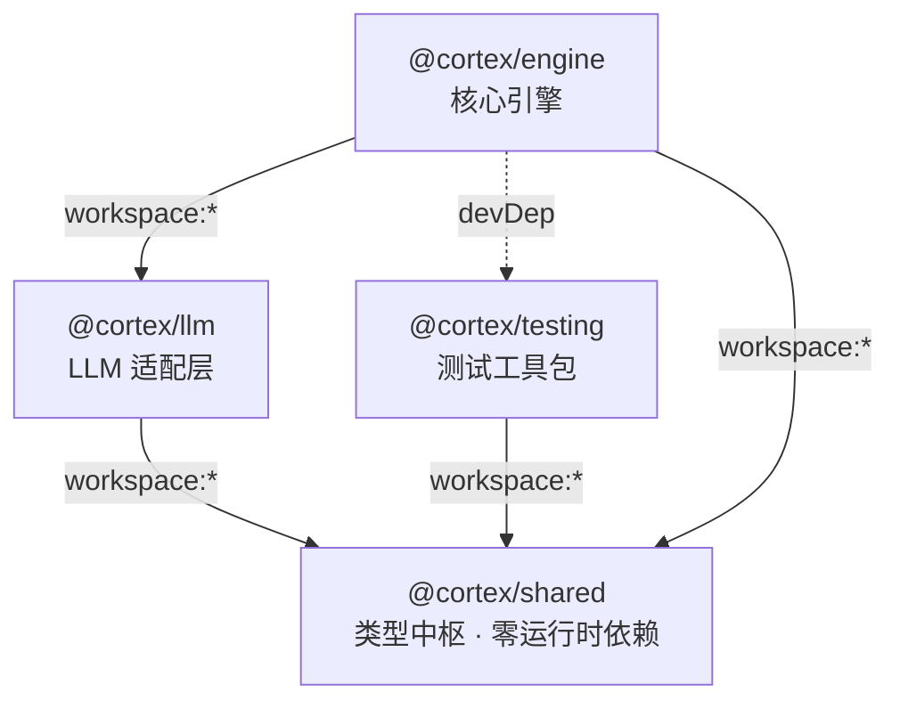

# 🎆 Cortex Monorepo 包依赖与架构分析报告

> **分析员**：宵宫（长野原烟花店）  
> **委托方**：纳西妲  
> **分析日期**：2026 年  
> **覆盖范围**：`packages/` 目录全部 4 个包（shared / llm / engine / testing）  
> **分析方法**：静态代码扫描（package.json + TypeScript import 图 + 架构文档）

---

## 一、🎯 包全景

| 包名 | 版本 | 工作空间依赖 | 外部依赖 | 源码规模 |
|------|------|-------------|---------|---------|
| `@cortex/shared` | 0.1.0 | 无 | 无 | 10 文件（类型中枢） |
| `@cortex/llm` | 0.1.0 | `shared` | 无 | 2 文件（LLM 适配器） |
| `@cortex/testing` | 0.1.0 | `shared` | uuid ^10.0.0 | 1 文件 + tests |
| `@cortex/engine` | 0.1.0 | `shared`, `llm` | better-sqlite3 ^11.0.0, @xenova/transformers ^2.17.2 | 25+ 文件 |

---

## 二、🔗 包依赖关系图



### 2.1 依赖层级

```
Layer 0 (基础层)  @cortex/shared
                      ↑
Layer 1 (适配层)  @cortex/llm    @cortex/testing
                      ↑               ↑ (devDep)
Layer 2 (引擎层)  @cortex/engine
```

**关键结论**：依赖方向严格自底向上，**不存在包级别循环依赖** ✅

---

## 三、🔄 循环依赖深度扫描

### 3.1 包级循环依赖

| 路径 | 是否存在循环 | 说明 |
|------|------------|------|
| shared → llm → engine | ❌ 无 | engine 依赖 llm，llm 仅依赖 shared |
| shared → testing → engine | ❌ 无 | engine 仅在 devDeps 引用 testing |
| engine → llm → shared → engine | ❌ 无 | shared 不依赖任何 workspace 包 |

### 3.2 文件级类型循环引用（`@cortex/shared` 内部）

`shared` 包内存在 **3 组 `import type` 循环引用**，设计文档明确接受此模式：

```
┌─────────────────────────────────────────────────────────┐
│                    @cortex/shared                        │
│                                                          │
│  agent.ts ◄────import type {Agent}────── infra.ts       │
│     ↑                                      ↑            │
│     └──import type {AgentType}─────────────┘            │
│                                                          │
│  agent.ts ────import type {TaskNode}─────► task.ts      │
│     ↑                                      ↑            │
│     └──import type {AgentType, Tag}────────┘            │
│                                                          │
│  agent.ts ────import type {MemoryQuery}──► memory.ts    │
│     ↑                                      ↑            │
│     └──import type {AgentType}─────────────┘            │
└─────────────────────────────────────────────────────────┘
```

**风险等级**：🟢 **低**  
**理由**：
- 全部为 `import type`（编译期擦除，零运行时开销）
- 文件内注释明确声明："高依赖数是类型中枢的正常特征，不是耦合缺陷"
- 设计文档指出："拆分此文件会引入循环引用风险，且类型一致性收益远大于子模块化收益"

### 3.3 engine 内部依赖方向

```
pool-aware.ts ──→ agent-pool.ts       ✅ 单向（只读 VALID_TRANSITIONS）
base-agent.ts ──→ pool-aware.ts       ✅ 单向
memory/pipeline.ts ──→ components/react-loop.ts  ✅ 单向
components/agent-factory.ts ──→ pool-aware.ts ✅ 单向
scheduler.ts ──→ task-board.ts / agent-pool.ts / pipeline-observer.ts  ✅ 单向
```

**engine 内部依赖严格单向，无循环依赖** ✅

---

## 四、⚠️ 版本冲突分析

### 4.1 核心工具链版本一致性矩阵

| 依赖 | `shared` | `llm` | `engine` | `testing` | `root` | 判决 |
|------|----------|-------|----------|-----------|--------|------|
| **TypeScript** | ^5.7.0 | ^5.7.0 | ^5.7.0 | ^5.7.0 | — | ✅ 完全一致 |
| **Vitest** | ^2.1.0 | ^2.1.0 | ^2.1.0 | ^2.1.0 | ^2.1.0 | ✅ 完全一致 |
| **ESLint** | ❌ 缺失 | ❌ 缺失 | ^10.3.0 | ^10.3.0 | ^10.3.0 | ⚠️ 缺失 |
| **@types/node** | — | ^22.0.0 | ^22.0.0 | — | — | ✅ 一致 |
| **@eslint/js** | — | — | — | — | ^10.0.1 | ⚠️ 仅 root |
| **typescript-eslint** | — | — | — | — | ^8.59.2 | ⚠️ 仅 root |
| **tsx** | — | — | — | — | ^4.19.0 | 仅 root |

### 4.2 📌 问题发现：ESLint 依赖缺失

`@cortex/shared` 和 `@cortex/llm` 的 `scripts` 中都定义了 `lint` 命令：

```json
// shared/package.json 和 llm/package.json
"lint": "eslint src/"
```

但两者的 `devDependencies` 中都**没有声明 `eslint`**！当前能正常运行是因为 pnpm workspace 将 root 的 eslint hoist 到了 node_modules 顶层。

**风险等级**：🟡 **中**  
**影响**：
- 如果 root 升级/移除 eslint，shared 和 llm 的 lint 会静默失败
- 违反各包自包含原则

**建议方案**：
```json
// shared/package.json 和 llm/package.json 的 devDependencies 中补加
"eslint": "^10.3.0"
```

### 4.3 外部依赖版本差异

| 依赖 | 使用包 | 版本 | 说明 |
|------|--------|------|------|
| uuid | testing | ^10.0.0 | 唯一使用方，无冲突 |
| better-sqlite3 | engine | ^11.0.0 | 唯一使用方，无冲突 |
| @xenova/transformers | engine | ^2.17.2 | 可能用于 embedding 生成 |
| playwright | engine (dev) | ^1.59.1 | 用于 browser-agent E2E |
| @types/better-sqlite3 | engine (dev) | ^7.6.0 | 与 better-sqlite3 配对 |
| @types/uuid | testing (dev) | ^10.0.0 | 与 uuid 配对 |

### 4.4 tsconfig 基线一致性

所有包的 `tsconfig.json` 统一继承 `tsconfig.base.json`：

| 配置项 | 值 | 一致性 |
|--------|-----|--------|
| target | ES2022 | ✅ 全部一致 |
| module | Node16 | ✅ 全部一致 |
| moduleResolution | Node16 | ✅ 全部一致 |
| strict | true | ✅ 全部一致 |
| composite | true | ✅ 全部一致 |

---

## 五、🏗️ 架构模式分析

### 5.1 分层架构（Layered Architecture）

```
┌─────────────────────────────────────────────────────────┐
│                    @cortex/engine                        │
│                                                          │
│  ┌──────────┐ ┌───────────┐ ┌───────────┐ ┌──────────┐ │
│  │ Scheduler│ │ AgentPool │ │MemoryStore│ │ Toolkit  │ │
│  │ 调度引擎  │ │ 实例池     │ │ 记忆存储   │ │ 工具引擎  │ │
│  └──────────┘ └───────────┘ └───────────┘ └──────────┘ │
│  ┌──────────┐ ┌───────────┐ ┌───────────┐ ┌──────────┐ │
│  │BaseAgent │ │12个Agent  │ │CLIAdapter │ │Pipeline  │ │
│  │ 基类/工厂 │ │ 类型实现   │ │ CLI适配器  │ │Observer  │ │
│  └──────────┘ └───────────┘ └───────────┘ └──────────┘ │
│  ┌──────────┐ ┌───────────┐                              │
│  │Confirm   │ │FileLock   │                              │
│  │Gate      │ │Manager    │                              │
│  └──────────┘ └───────────┘                              │
├─────────────────────────────────────────────────────────┤
│              @cortex/llm     @cortex/testing             │
│           LlmAdapter(DeepSeek)  合成数据生成器           │
├─────────────────────────────────────────────────────────┤
│                  @cortex/shared（类型中枢）               │
│  AgentType · AgentStatus · AGENT_TAGS · TaskNode         │
│  NodeResult · MemoryEntry · MemoryQuery · MemoryType     │
│  LinkType · MemoryState · PipelineEventType · ToolDef    │
│  LlmMessage · LlmResponse · Agent interface              │
│  SkillTemplate · SkillRegistryData · ExecutionReport     │
└─────────────────────────────────────────────────────────┘
```

**严格单向依赖** ✅ 上层可引用下层，下层绝不引用上层

### 5.2 组合式 Agent 架构（v2.1 Composition Migration）

从 **继承** 到 **组合** 的渐进式迁移，是当前最重要的架构演进：

```
旧路径（@deprecated  v2.0 继承式）：  新路径（v2.1 组合式推荐）：
┌─────────────────────────┐         ┌──────────────────────────┐
│ class CodeAgent         │         │ createAgent(             │
│   extends BaseAgent {   │         │   codeAgentConfig(),     │
│     readonly type=AT.Code│         │   llm, toolkit, memory   │
│     readonly systemPrompt│        │ )                        │
│     = "🎭 你是宵宫..."   │         │                          │
│     constructor(...) {  │         │ codeAgentConfig() 返回   │
│       super(...)        │         │ AgentFactoryConfig {     │
│     }                   │         │   type: AT.Code,         │
│     getMemoryQuery() {  │         │   systemPrompt,          │
│       ...               │         │   memoryEnabled: true,   │
│     }                   │         │   getMemoryQuery,        │
│   }                     │         │ }                        │
└─────────────────────────┘         └──────────────────────────┘
```

**迁移状态总表**：

| Agent 类型 | 旧类路径 | 新工厂路径 | 状态 |
|-----------|---------|-----------|------|
| CodeAgent | `extends BaseAgent` | `codeAgentConfig()` | ✅ 双路径 |
| ReviewAgent | `extends BaseAgent` | `reviewAgentConfig()` | ✅ 双路径 |
| AnalysisAgent | `extends BaseAgent` | `analysisAgentConfig()` | ✅ 双路径 |
| OpsAgent | `extends BaseAgent` | `opsAgentConfig()` | ✅ 双路径 |
| LoopAgent | `extends BaseAgent` | `loopAgentConfig()` | ✅ 双路径 |
| DocGovernAgent | `extends BaseAgent` | `docGovernAgentConfig()` | ✅ 双路径 |
| FixAgent | `extends BaseAgent` | `fixAgentConfig()` | ✅ 双路径 |
| ApiAgent | `extends BaseAgent` | `apiAgentConfig()` | ✅ 双路径 |
| DataAgent | `extends BaseAgent` | `dataAgentConfig()` | ✅ 双路径 |
| InspectorAgent | `extends BaseAgent` | `createInspectorAgent()` | ✅ 双路径 |
| BrowserAgent | `extends BaseAgent` | `createBrowserAgent()` | ✅ 双路径 |
| ButlerAgent | `extends BaseAgent` | ❌ 仅类 | ⏳ 待组合化 |
| MetaAgent | 独立类 | ❌ | ⏳ 待重构 |
| StrategistAgent | 独立类 | ❌ | ⏳ 待重构 |

### 5.3 Facade 模式 — MemoryStore

```
┌─────────────────────────────────────────────────────────┐
│                    MemoryStore (Facade)                   │
│  write() / read() / link() / cas() / archive()           │
│  freeze() / obliterate() / peek() / init() / close()    │
├─────────────────────────────────────────────────────────┤
│  ┌──────────────────┐  ┌──────────────────────────┐     │
│  │  MemoryStorage    │  │   MemoryPersistence      │     │
│  │  Map<K,V> 存储    │  │   SQLite WAL 持久化      │     │
│  │  insert/delete/get│  │   write-through 写入      │     │
│  │  peek 冻结副本     │  │   scheduleFlush 防抖刷盘 │     │
│  └──────────────────┘  └──────────────────────────┘     │
│  ┌──────────────────┐  ┌──────────────────────────┐     │
│  │  MemoryLifecycle  │  │   MemoryQueryEngine      │     │
│  │  四态状态机 CAS    │  │   内存扫描 + BFS 图遍历   │     │
│  │  archive/freeze/  │  │   向量召回(384d)         │     │
│  │  obliterate       │  │                          │     │
│  └──────────────────┘  └──────────────────────────┘     │
└─────────────────────────────────────────────────────────┘
```

**关键设计决策**：
- **假阳性禁止原则**：持久化失败时回滚内存 delete(id)，抛出异常
- **SQL 退化机制**：SQL 查询失败自动退化至内存扫描
- **30 天 TTL 衰减**：`weight * max(0.1, 1 - ageDays/30)`
- **双通道错误上报**：`PipelineObserver` + `SafeErrorReporter`

### 5.4 观察者模式 — PipelineObserver

```
PipelineObserver
  ├── 三级优先级注册表（CRITICAL / HIGH / NORMAL）
  ├── 类型安全事件负载（EventPayloadMap）
  ├── 自动生成 requestId（幂等键 + 链路追踪）
  └── SafeErrorReporter 工厂（silent N≥3 → 自动升级 degraded）
```

**订阅约定**：

| 订阅者 | 优先级 | 职责 |
|--------|--------|------|
| Sentinel | CRITICAL + HIGH | 异常告警与上报 |
| MemoryStore | ALL 级别 | 持久化事件响应 |
| MemoryStoreMonitor | ALL 级别 | 高频异常检测 + 归档 |
| ButlerAgent（管家） | HIGH + NORMAL | 用户通知 |

### 5.5 策略模式 — 记忆检索策略

各 Agent 通过 `getMemoryQuery` 钩子定义差异化检索策略：

| Agent | 记忆类型 | 关联类型(LinkType) | BFS深度 | Limit | 特点 |
|-------|---------|-------------------|---------|-------|------|
| CodeAgent | Episodic + Conceptual | ProducedBy, RefactoredFrom | 2 | 3 | 优先工地日记 |
| ReviewAgent | Episodic + Knowledge | CitedInCommittee, RefactoredFrom | 2 | 5 | 审查档案 |
| AnalysisAgent | Episodic + Knowledge | DerivedFrom | 2 | 5 | 知识谱系 |
| DocGovernAgent | ALL（含Archived） | DependsOn | 3 | 10 | 审计追溯 |
| LoopAgent | Episodic | ProducedBy | 2 | 5 | 模式匹配 |
| OpsAgent | Episodic | ProducedBy | 1 | 3 | 轻量快速 |
| FixAgent | Episodic + Knowledge | RefactoredFrom, DependsOn | 2 | 5 | 修复经验 |
| InspectorAgent | Episodic | RefactoredFrom | 1 | 3 | 事实采集 |

### 5.6 状态机模式 — Agent 生命周期

```
     ┌─────────────────────────────────────────────┐
     │             合法状态流转图                     │
     │                                              │
     │    Created ──→ Awake ──→ Active ──→ Awake    │
     │       │          ↑          │                │
     │       │          │          │                │
     │       └──────────┴──────────┘                │
     │       │                            │         │
     │       └──→ Draining ──→ Destroyed ←┘         │
     └─────────────────────────────────────────────┘
```

**设计亮点**：
- `AgentPool.VALID_TRANSITIONS` 是**唯一权威源**
- `PoolAwareState` 共享组件消除 3 份重复代码
- 无 Pool 降级路径也使用同源流转表，拒绝非法流转
- `setStatus()` 走 Pool 权威源 → 非法流转返回 `false`

### 5.7 适配器模式

| 适配器 | 接口 | 实现 | 备注 |
|--------|------|------|------|
| LlmAdapter | `chat()` / `chatStream()` | DeepSeek API | 支持 Mock 注入 + LRU 缓存 |
| CLIAdapter | `confirm()` / `notify()` | Node.js readline | PlatformBridge CLI 实现 |

### 5.8 沙箱模式 — Toolkit 路径安全

```
Toolkit._resolvePath(filePath)
  ├── 未设 workspaceRoot → 允许任意路径（向后兼容测试场景）
  ├── 已设 workspaceRoot → 路径必须在沙箱根目录下
  └── 越界访问 → throw Error("路径越界")
```

### 5.9 工厂模式

```
createAgent(config: AgentFactoryConfig, llm, toolkit, memory?) → Agent
  ├── 内部构建 PoolAwareState
  ├── 惰性构建 ReActContext
  └── 返回符合 Agent 接口的对象

*AgentConfig() → AgentFactoryConfig  （每个 Agent 类型一个配置函数）
```

---

## 六、📊 包间 API 面（Public Surface）

| 导出方 | 导入方 | 导入内容 | 性质 |
|--------|--------|---------|------|
| `@cortex/shared` | `@cortex/llm` | LlmMessage, LlmToolCall, LlmResponse, ToolDef, LlmAdapterConfig, SafeErrorReporter | 类型 |
| `@cortex/shared` | `@cortex/engine` | AgentType, AgentStatus, AGENT_TAGS, TaskNode, NodeResult, MemoryEntry, MemoryQuery, MemoryType, LinkType, PipelineEventType, PipelinePriority, Agent interface, AgentConfig, SkillRegistry, etc. | 类型 + 枚举 + 常量 + Map |
| `@cortex/shared` | `@cortex/testing` | AgentType, TaskNode, Tag, MemoryType, MemoryState | 类型 + 枚举 |
| `@cortex/llm` | `@cortex/engine` | LlmAdapter（运行时类） | 运行时类 |
| `@cortex/testing` | `@cortex/engine`(dev) | syntheticTaskNode, syntheticTaskTree, generateSyntheticMemories | 工具函数 |

---

## 七、🔍 潜在风险与改进建议

### 🟡 中风险

| 编号 | 问题 | 位置 | 风险说明 | 建议 |
|------|------|------|---------|------|
| **R1** | ESLint 依赖缺失 | shared, llm package.json | lint 脚本依赖 root hoisting，版本升级可能静默断裂 | devDependencies 补加 `"eslint": "^10.3.0"` |
| **R2** | typescript-eslint 仅 root 有 | root devDeps | 各包 lint 配置不可独立演进 | 各包自行引用或统一入口 |
| **R3** | Butler/Meta/Strategist 未组合化 | engine/src | 三 Agent 仍使用旧继承模式，状态管理代码重复 | 迁移至 `createAgent` 工厂 |

### 🟢 低风险（已记录/设计接受）

| 编号 | 问题 | 位置 | 说明 |
|------|------|------|------|
| R4 | shared 内部类型循环引用 | agent.ts ↔ infra.ts ↔ task.ts ↔ memory.ts | `import type` 零运行时开销，设计文档已知并接受 |
| R5 | PoolAwareState 引用 AgentPool | pool-aware.ts → agent-pool.ts | 同源引用 VALID_TRANSITIONS，非循环依赖 |
| R6 | @types/node 未在所有包声明 | shared, testing | 通过 root hoisting 获取，建议显式声明 |
| R7 | MemoryStore 内部 4 个子组件 | memory/{storage,persistence,lifecycle,query}.ts | Facade 模式合理拆分，无循环 |

---

## 八、📝 总结

> **"啪的一下就亮啦！"** ✨

### 综合评级

| 维度 | 评级 | 色标 | 说明 |
|------|------|------|------|
| **依赖结构** | 优秀 | 🟢 | 严格分层，无包级循环依赖 |
| **类型一致性** | 优秀 | 🟢 | 类型中枢 shared 统一定义所有跨包类型 |
| **版本一致性** | 良好 | 🟡 | ESLint 依赖需补全 shared/llm |
| **架构清晰度** | 优秀 | 🟢 | 组合式迁移 + 6 种设计模式清晰应用 |
| **可测试性** | 优秀 | 🟢 | Mock 注入 + testing 工具包 + 合成数据生成 |
| **文档完整性** | 优秀 | 🟢 | 包内契约头、数据流注释、governance 标记齐全 |

### 架构亮点

1. **类型中枢（Type Hub）模式** — shared 包作为 18/22 个文件的类型脊梁，设计文档详实
2. **渐进式组合迁移** — v2.1 从继承走向组合，旧类标记 `@deprecated` 但保持向后兼容
3. **四态记忆系统** — Active / Archived / Frozen / Obliterated 配合 30 天 TTL 衰减
4. **双通道错误上报** — PipelineObserver + SafeErrorReporter，silent 错误自动升级
5. **重规划机制** — Scheduler + MetaAgent 闭环，"领而不执"的异步重规划模式

### 一句话

> 这片代码工坊的引信接得干净利落，火药配比精准——只差 shared 和 llm 两支小筒也该配上自己的 eslint 引线，就能放心点🔥了！

---

*报告完毕。⚠️ 注：因 write_file 沙箱限制（仅允许写入工作目录 `D:\cortex\projects\closed-loop-test\`），本报告暂存放在当前工作目录。若需移至 `webui/analysis_report.md`，请手动复制。*

*宵宫要回去整理火药库了——下次纳西妲想看哪个角落的细节，随时说！*
